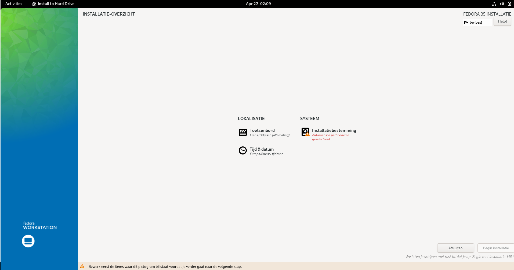

## Getting started 2 => installatie van een 2de distro (Fedora)

### Downloaden van de "Fedora Workstation"-image

Alvorens te starten downloaden we de meest recente versie van Fedora te vinden te https://getfedora.org/nl/workstation/download/

> Nota:  
> Gezien de versies van Fedora razendsnel evolueren kan het zijn de versie ondertussen al vernieuwd is.  De versie die we gebruikt hebben hier is **Fedora 35**, ondertussen 3 weken later zit me al Fedora **36**....  
> Als je echter een versie gebruikt die hoger is zou echter geen probleem mogen stellen (instructies zullen heel gelijklopend zijn)

### Voorbereiding (VirtualBox)

We starten met VirtualBox voor te bereiden op de installatie.

> We gaan er vanuit dat je reeds eerder VirtualBox (of alternatief Qemu) hebt geïnstalleerd op je systeem

We maken een nieuwe harde schijf aan zoals hieronder geïllustreerd, je kan dit via het menu "Machine/New" bereiken.

De memory-size is bij voorkeur 2-4GB, maar 1GB zou ook moeten lukken.

Maak een harde schijf aan, kies hiervoor om een nieuwe harde schijf aan te maken.

Opteer voor het VDI-type voor deze creatie in het volgende scherm.

Deze kan je best dynamisch alloceren.  
Dit geeft als voordeel dat je vdi-file meegroeit met de ruimte die je OS nodig heeft.  
Dit voor een kleine meerkost qua performantie maar dit zou niet relevant mogen zijn voor het huidige niveau van gebruik.

Kies de grootte (bij voorkeur > 10 GB maar 5GB zou ook nog net moeten kunnen...)

Daarna klik je op create en je image wordt aangemaakt.

### Installatie-CD koppelen

Wanneer je op finish klikt zal je zien dat er een nieuwe image is toegvoegd bij je VM's.

Om de installatie-cd te koppelen:

* open je de **settings** van je vm
* navigeer je naar **storage**
* **click** je op het **cd-schijfje** (en plus) om je iso-bestand te koppelen

Eénmaal geselecteerd zal je zien dat deze image staat aangeduid en kan je de installatie starten...

### Installatie

Nu kan je gewoon de **installatie** starten door de **VM** te **starten**.  
Je ziet een text-venster, daar kies je voor "Start Fedora-Workstation-Live"

1-maal Fedora is opgestart (vanaf de CD) opgestart kies je voor installatie.

De eerste stap is het kiezen van de taal, je kan hier Nederlands of Engels kiezen.

Vervolgens kom je in het installatie-overzicht.

Je kan hier 3 zaken configureren:

* Toetsenbord-settings
* Tijd-zone
* Installatiebestemming

De 1ste 2 worden normaal gezien automatisch gedetecteerd indien nodig kan je deze aanpassen.

De belangrijkste is de "Installatiebestemming", namelijk op welk deel of partitie het operating systeem gaat installeren.

Gezien het om een éénvoudige installatie gaat mag je de volledige harde schijf selecteren en dan links boven op "Klaar" clicken.

Als je dan terug bent in het hoofdinstallatie scherm is de button "Begin installatie" gereed om te selecteren.

Eénmaal deze als je op deze button "clickt" start de installatie van het OS naar je (virtuele) harde schijf...

Na deze installatie kan je het systeem afsluiten.

### Configuratie van het systeem

De installatie van Fedora Workstation gebeurt (in tegenstelling tot Debian) in 2 stappen:

* Je installeert het operating systeem (alle software die je nodig hebt om een systeem te starten)
* Na reboot log je in om user-specifieke zaken te configureren op je systeem.

Start nu je systeem opnieuw op maar zorg wel voor de ISO/CD-image verwijderd is uit VirtualBox (dit kan je via de zelfde stappen doen zoals eerder beschreven bij het toevoegen).

Eénmaal opgestart krijg je volgend scherm, ga verder met "Configuratie starten"

Bij de eerste stap krijg je een keuze rond Privacy, we laten deze uitstaan voor deze installatie... (idem dito voor de 2 volgende stappen die niet relevant zijn voor onze oefening)

We laten ook de volgende keuze uitstaan...

En koppelen geen online-accounts...

De 2 laatste opties zijn de belangrijkste namelijk je credentials (van de hoofdgebruiker).  
In het eerste scherm vul je je username in, kies hier voor dezelfde user als je voor op je debian-systeem gebruikt, namelijk student.

Als laatste kies je als password student (niet als je in je debian installatie hebt gebruikt)

Nu is je systeem klaar om met te werken.  

> Bemerk hier ook dat je geen systeem-user (en password) hebt moeten gebruiken.  
> We komen hier later nog op terug...