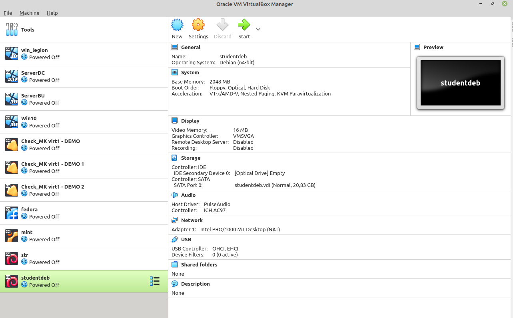
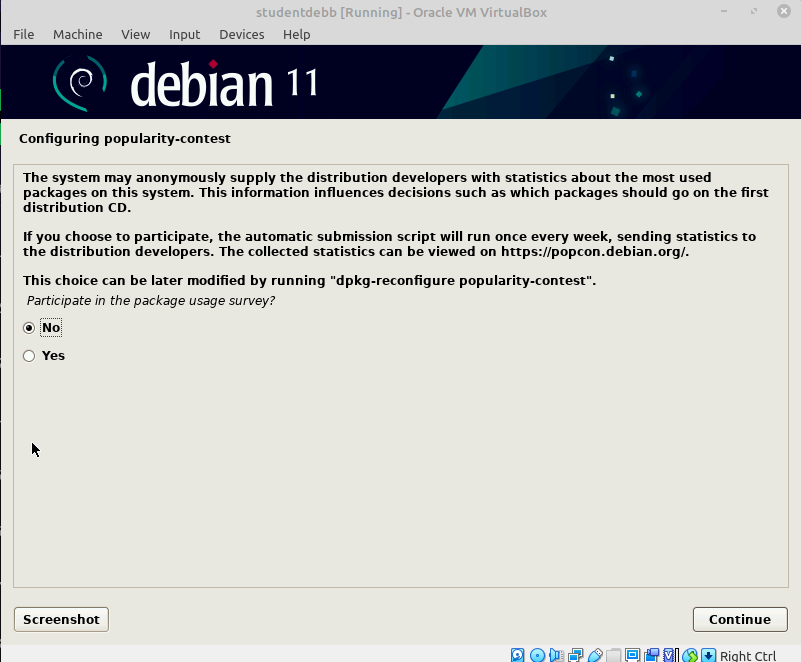
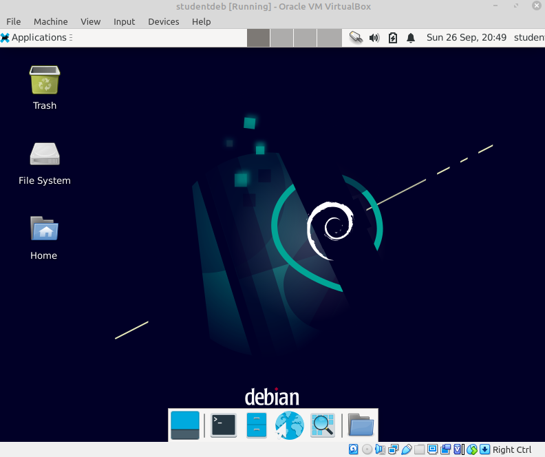

## Getting started => installatie van een Linux-distro!! (Debian)

Vooraleer we met de cursus starten moeten we leren een **Linux-distro** te **installeren**.  

Gezien dat het merendeel van de studenten met een **Windows-** of
**Apple-**besturingssysteem **opgeschept** zitten (ipv een Linux-distributie)
maken we gebruik van virtualisatie om met Linux kennis te maken.

Binnen de cursus maken we gebruik van **Virtualbox** hiervoor, hetgeen we in
deze cursus zullen gebruiken.

> Mocht je ervaring hebben of voorkeur geven aan een andere technologie
> (Qemu, VMWare, ...) mag dit ook (maar dan is er geen support
> gegarandeerd).

### Opzetten van een Virtual Image met VirtualBox

We starten deze cursus met het installeren van een Linux-distributie.  
We gaan hiervoor **Debian** gebruiken.

#### Installatie Virtualbox

Virtualbox is vrij beschikbaar voor Linux, Windows en Mac.  
Meer informatie en downloads https://www.virtualbox.org/wiki/Downloads

Installeer deze applicatie voordat met dat je verder gaat... 

#### VirtualBox-Manager

Eenmaal VirtualBox geïnstalleerd is deze beschikbaar via het **menu** van je
HOST-besturingssysteem (Linux, Mac of Windows).

> We zullen in deze cursus verwijzen naar **host** en **guest**:
> 
> * **Host** => Het besturingssysteem van je **computer** waar Virtualbox binnen draait
> * **Guest** => Het besturingssysteem dat **binnen Virtualbox** draait

Als je deze applicatie **opent** kom je terecht in de "**VirtualBox Manager"**,
deze applicatie geeft je een **overzicht** van de **bestaande VM's** (Virtual
Machines).

> Als je Virtualbox net geïnstalleerd hebt zijn er vanzelfsprekend nog geen images te zien.

Vanuit dit overzicht kan je deze **images configureren en opstarten**.

#### Aanmaken van een Virtualbox image

We **starten** met het **aanmaken** ven een **image**, dit is een "virtuele" harde schijf waarop je besturingssysteem zal geïnstalleerd worden.
Je **kiest** in het Virtual Box-menu **Machine/New**

Het onderstaand **configuratiescherm** verschijnt:

Vul hier de volgende **gegevens** in:

* De **naam** **studentdeb**
* **Type** (besturingssysteem) **Linux**
* Kies als **versie** (distributie) **Debian**

Druk op **"Next"** om te vervolgen.  
Je **virtuele machine** zal een deel van het **geheugen** van je **hostmachine**
innemen.

In het volgende scherm dien je het **maximale RAM-geheugen** in te geven dat dit systeem mag innemen:

> Hier wordt er gekozen voor 2GB want aangeraden is als je met een
> GUI-based OS (Graphical User Interface) werkt. Als je PC echter een
> beperkte RAM heeft (\< 4GB) mag je dit ook beperken tot 1GB (1024MB)

##### Aanmaken harde schijf

Net zoals bij de installatie van een besturingssysteem op een fysische
machine (PC, Server, Raspberry Pi...) heb je een **harde schijf** of
**persistente opslag** nodig.

In het geval van een Virtuele Machine, wordt deze schijf **geemuleerd** door
middel van een **file** (VDI).

In dit geval mag je gewoon de optie "Create a virtual hard disk now"
kiezen:

Vervolgens mag je de installatie verder zetten met de standaard
VDI-optie

Bij de volgende optie kiezen we voor een **dynamisch gealloceerd**
VDI-bestand. Dit zorgt ervoor dat de van het bestand zal **groeien**
naarmate de het **besturingssysteem meer plek zal opnemen**.  
Als je "Fixed Size" selecteert zal deze file direct de voorgedefinieerde plek in nemen
(zie volgende stap), hetgeen iets **performanter** is maar wel onnodige plek
op je hard disk zal innemen.

Vervolgens bepaal je de **grootte** van deze **harde schijf**.

Als je voldoende plek hebt mag die **20-30 GB** innemen, anders moet je deze
zien aan te passen naar wat je kan gebruiken (probeer wel een **minimum**
van **10 GB** te nemen indien mogelijk)

Vervolgens kies voor "Create" en deze image (samen met andere
metadata-bestanden) worden aangemaakt.

Zoals je zie is er binnen je VirtualBox-Manager een **nieuwe entry**
toegevoegd.

Als je met de met de rechter-muisknop binnen de VirtualBox-manager de
optie "Show in Filemanager" kiest heb je de mogelijk de bestanden te
zien die aan deze installatie zijn gekoppeld:

* studentdeb.vdi => virtuele harde schijf
* studentdeb.vbox => xml-bestand met de configuratie van de image
* studentdeb.vbox.prev => backup van bovenvermeld xml-bestand

Dit is vanzelfsprekend extra info, in de meeste gevallen moet je geen
rekening met houden.

##### Downloaden van Debian

Als laatste voorbereiding voor de eigenlijke installatie moeten we een
installatie uitvoeren van Linux.

We maken gebruik van Debian 11 (Debian Bullseye) om een Linux-distro te
installeren.

Ga hiervoor naar de website https://www.debian.org/

Daar kan mag je gewoon de knop Download klikken en normaal gezien zal
een download starten.\

Alternatief mag je ook rechtstreeks de link https://cdimage.debian.org/debian-cd/current/amd64/iso-cd/debian-11.0.0-amd64-netinst.iso gebruiken.

De download neemt +- 360 MB in beslag.  
Het betreft hier een ISO-image die een minimale installatie voorzien van
een Debian-installatie, hou er dus wel rekening mee dat je een
internetverbinding zal nodig hebben om een installatie uit te voeren van
de extra software die we gaan gebruiken in de cursus.

##### Koppelen van de Debian ISO-image

Als je op een fysisch systeem gaat installeren ga je deze ISO-image
branden op een CD-ROM, DVD, via NETBOOT of (vandaag meer gebruikt) een
USB-stick.

Binnen Virtualbox echter kan je dit bestand echter direct koppelen als
een (virtuele) CD/DVD.

Hiervoor mag je -- in de VirtualBox Manager -- klikken met de
rechtermuisknop je "studentdeb"-VM en "Settings" kiezen.

Vervolgens:

-   Navigeer je naar Storage
-   Positioneer jezelf op de lege DVD (onder Controller: IDE)
-   Klik je vervolgens op het Disk-icon aan de rechterkant van het
    scherm
-   En selecteer je "Choose a disk file"

Vervolgens opent er zich een scherm waar je de -- eerder gedownloade
image kan koppelen (eenmaal gevonden selecteer je de ISO-image en klik
je op open)

Als resultaat zal je zien dat deze image "virtueel" is geplaatst als
CD/DVD-image

We zijn nu (eindelijk) klaar om van start te gaan met de werkelijke
installatie...

### Installatie van Debian Bullseye

Om je Virtuele Machine (en bijhorende installatie over de CD/DVD) te
starten volstaat het dubbel te klikken op studentdeb-VM (alternatief kan
je dit ook via het menu of door de image te selecteren en bovenaan op
start de drukken)

Eenmaal deze gestart is kom je in het Debian-installer-scherm.

Van deze opties kies je voor "Graphical Install"

(de optie Install is hetzelfde maar gaat over een zuiver
tekst-georienteerde installatie, zonder muis)

Je drukt gewoon op enter en de installatie zal starten...

#### Locatie- en taalgegevens kiezen

De eerste stap is het selecteren van de taal, we kiezen hier voor
**Engels**:

Druk op **Continue**, de volgende stap nu is het **selecteren** van je **locatie**:

**België** is **niet** in het **hoofdmenu** voorzien, dus selecteer **"other"** en klik
op **"Continue"**

**Kies** vervolgens voor **"Europe"**

Tenslotte kan je **België** selecteren als land waar je VM toebehoort
(hetgeen wordt gebruikt om je timezone te weten te komen)

Aan een taal wordt ook een "locale" gekoppeld die aanduidt welke variant
van Engels er zal gebruikt worden, kies hier voor de "en\_US"-versie

Daarna selecteer je het keyboard.

Als je de standaard Belgische **Azerty-layout** gebruikt kan je de keuze maken zoals geïllustreerd, anders selecteer je het keyboard dat op jij setup van toepassing is:

> Vanzelfsprekend kies je een andere layout als dat van toepassing is op je PC...

**Eenmaal** het **keyboard geselecteerd** klik je op **"Continue"** en de
installatie-image gaat een aantal **netwerk-configuraties** uitvoeren:

#### User en naam-gegevens

Je Debian-installatie heeft een **hostname** nodig, je kiest hier de naam
**studentdeb**, probeer deze naam te behouden gezien deze naam bij
toekomstige voorbeelden zal terugkomen.

Klik op "Continue", de **domain-naam** mag je voorlopig ook **negeren**

Vervolgens dien je een **password** in te dienen voor je **root-account**.  
Dit is een account waarmee je alle permissies hebt en die je normaal gezien
**enkel gebruikt** om **systeem-configuraties** of **installaties** uit te voeren (te
vergelijken in de Windows-wereld met Administrator-rechten)

We dienen hier een **password** te gebruiken dat je **kan onthouden**...  
Gezien het hier een proefstelling is gebruik ja als password **student**

> Gezien deze image enkel voor educatieve doeleinden zal worden gebruik
mag je een gemakkelijk paswoord kiezen.
>Doe dit echter **nooit** als je met je
eigen machine werkt (of een machine voor productiegebruik)

Vervolgens vraag het systeem jou een **standaard user** te maken (met root
werk je enkel bij administratieve taken zoals installaties).

**Maak** hiervoor een user **"student"** en bijhorend password **student** (zelfde als bij root).

#### Disk en partionering

Volgende stap is het kiezen op welke harde schijf (en of partitie) we Debian gaan
installeren.  
We kiezen hier voor **"Guided Partitioning"**

En gebruiken de **volledige disk** (we komen later nog terug op LVM)

Vervolgens **selecteren** we de **disk**:

En we kiezen ervoor alle onderdelen/files in dezelfde partitie bij te
houden

Het systeem stelt vervolgens een **overzicht** voor van **installatie**

Als je op Continue klikt kom je bij een laatste bevestigingsscherm, dit is - veiligheidshalve - aangeduid met **No**

Hier die je echter **Yes** te selecteren alvorens te kunnen verder gaan met installeren.  
Eénmaal je hier je deze Yes bevestigt met Continue zal de installer wijzigingen naar je harde schijf beginnen te schrijven...

#### Installatie van het basissysteem

Vervolgens **start** de **installatie** van het **"base system"**, maw alle **software** die **nodig** is voor het opstarten van een minimale Debian-installatie
(zonder Graphical User Interface).

Na deze installatie zal deze **voorstellen** of er nog installatie-media
zijn (extra CD's en/of USB-stick). Hier mag je gewoon **nee** kiezen, alle
**volgende software gaan we installeren via het netwerk**.

#### Installatie van (extra) software

Ondertussen staat er een **basis systeem** geïnstalleerd waar je kan op
connecteren door middel van een text-terminal.

We gaan echter nog **software** bij **installeren** zodat we ook een **GUI** ter
beschikking hebben aangevuld met wat **extra** **tools** om het beheer van een
systeem te kunnen uitvoeren.

##### Configureren van een package-manager

Vele Linux-distributies werken met een **package-manager**.

Dit is een **tool** - verbonden aan je **distro** - die je in staat stelt
**software** te installeren (en te onderhouden).  

Naast de installatie zal een package-manager ook het nodige doen om deze
software regelmatig up te daten met (gevalideerde) verbeteringen en/of
security-patches.

> Je kan vanzelfsprekend ook software installeren zonder deze packagemanagers, maar deze garanderen meestal wel dat de versie van software die je installeert goed getest is op het systeem...

De **package-manager** gebruikt door Debian - **aptitude** - maakt gebruik van repositories op het internet om deze software te vinden en installeren.  
In de 2 volgende stappen dien je een mirror te installeren die deze
software bevat...

Als eerste stap selecteer je het **land** van waaruit je deze updates zal doen (by default het land dat je eerder ingaf)

Vervolgens wordt er je een aantal keuzes voorgesteld, selecteer hier 1
van de keuzes (bij voorkeur kan je een Belgische mirror selecteren
hetgeen iets performanter kan zijn)

Gezien je **Debian-installer** nu naar het **internet** zal gaan om software (en metadata) te downloaden wordt er nog gevraagd een **proxy** mee te geven als
dit nodig is.

In de **meeste gevallen** kan je dit **blanco** laten, in vele bedrijfsnetwerken
kan het zijn dat je deze proxy moet configureren om aan het internet te
geraken.

De installer gaat vervolgens op zoek naar beschikbare software

Als dit gedaan is krijg je nog de vraag of je systeem statistieken mag doorsturen rond het installeren van packages.

Hierop staat het je vrij dit te beslissen dit door te sturen of niet...

Wat je keuze ook is klik op Continue om de volgende stap van de installatie te starten...

##### Selecteren van software

Hier wordt er gevraagd welke software er nog bij worden
geïnstalleerd.  

We **kiezen** hier de **opties**:

* **Debian** Desktop Environment (X-server installatie)
* **Xfce** =\> lichtgewicht desktop environment
* **Standaard System Utilities**

Nadat je op "Continue" klikt zal de installer de nodige software
downloaden en installeren...

#### Bootloader installeren (GRUB)

Een laatste - maar noodzakelijke - stap is het installeren van een
bootloader.  
Dat is een stuk software die - voordat het besturingssysteem (en kernel) wordten opgestart - een aantal noodzakelijke initialisaties doet.

Kies "Yes" om deze te installeren op je harde schijf...

... en gezien we maar met 1 image/schijf werken mag je deze
selecteren\...

Vervolgens wordt deze geïnstalleerd ...

#### Beëindigen van de installatie

Na het installeren van de bootloader is de installatie compleet, als je
nu op "Continue" zal de VM rebooten en zal Debian opstarten.

Je ziet dat de installer vraagt om de installatie-CD/DVD te verwijderen
opdat je niet per ongeluk niet opnieuw de installer opstart.

VirtualBox zal deze echter automatisch -- bij reboot -- voor jou
ontkoppelen.

### Opstarten van Debian (Xfce)

Bij het opstarten zal eerst het GRUB-scherm verschijnen waar je de keuze
wordt geboden tussen Debian op te starten of extra boot-opties te
configureren.

Eénmaal Debian opgestart krijg je een scherm om in te loggen, voor daar
als user "student" in en als password het password dat je eerder hebt
gekozen:

Vervolgens kom je terecht in de Xfce-desktop:

### Installatie van de Guest Additions

Zoals je waarschijnlijk zult ervaren is er maar en beperkte keuze in
schermresolutie.

Virtualbox zal niet aanpassen aan de resolutie van host en als gevolg
zal je een kleiner scherm krijgen zoals hieronder geillustreerd\...

Om de **"user experience"** te verbeteren gaan gaan we -- vanuit de
VirtualBox Manager -- de "Guest Additions" installeren/activeren.

#### Insert Guest Additions

Als eerste stap kies je in de "Virtualbox Manager" de menu-entry
**Devices/Insert Guest Additions** CD Image.

Als dit de **eerste maal** is dat je deze Guest Additions gebruikt zal
Virtualbox **vragen** of deze **mag "gedownload"** worden

**Klik** op **Download**, vervolgens zal Virtualbox dit opnieuw voorstellen en
kies je opnieuw Download

En bevestig je nog een laatste maal om deze CD/DVD te voorzien (insert)

#### Installatie van de Guest Additions via de terminal

Nu dat de installatie-scripts beschikbaar zijn kan je binnen je Guest (Debian) de **additions** installeren.

##### Openen van console

Voor de volgende stap heb je een een terminal-scherm nodig, klik hiervoor  **onderaan** in de **dock** op het **2de ico
n van links**.

Vervolgens krijg je een **console** geopend waar je **commandos** kan in
uitvoeren (we komen hier in de volgende hoofdstukken nog ruim op terug)

Vervolgens krijg je een **console** geopend waar je **commandos** kan in uitvoeren (we komen hier in de volgende hoofdstukken nog ruim op terug)

##### Installatie via de console

Eenmaal in de console voer je de volgende commando's uit:

Je wijzigt de user in de shell naar de root-user (su =\> switch user) via het volgende commando:

Dit commando zal het password van je root-user opvragen (dat je eerder had ingegeven bij installatie).  
Je zal niet wat je typt, dat is normaal bij command-line-apps als je je password intypt, druk gewoon enter als je password hebt ingegeven.

~~~
student@studentdeb:~$ su -
Password:
root@studentdeb:~# 
~~~

Zoals je ziet is de prompt bij deze console gewijzigd van "student@studentdeb:~$" naar "root@studentdeb:~#", dit houdt in dat je in root-modus bent beland...

Vervolgens voer je het volgende commando uit binnen deze console:

~~~
root@studentdeb:~# mount /media/cdrom0/
mount: /media/cdrom0: WARNING: source write-protected, mounted read-only
root@studentdeb:~#
~~~

Zoals je ziet geeft deze een kleine warning, deze mag je negeren.  
Het volgende commando is de **eigenlijke installatie** van deze Guest-Additions.  
Het commando dat je intypt (op de 1ste lijn) zal heel wat output geven zoals je hieronder ziet...

~~~
root@studentdeb:~# sh /media/cdrom0/VBoxLinuxAdditions.run --nox11
Verifying archive integrity... All good.
Uncompressing VirtualBox 6.1.38 Guest Additions for Linux........
VirtualBox Guest Additions installer
Copying additional installer modules ...
Installing additional modules ...
VirtualBox Guest Additions: Starting.
VirtualBox Guest Additions: Building the VirtualBox Guest Additions kernel 
modules.  This may take a while.
VirtualBox Guest Additions: To build modules for other installed kernels, run
VirtualBox Guest Additions:   /sbin/rcvboxadd quicksetup <version>
VirtualBox Guest Additions: or
VirtualBox Guest Additions:   /sbin/rcvboxadd quicksetup all
VirtualBox Guest Additions: Kernel headers not found for target kernel 
5.10.0-18-amd64. Please install them and execute
  /sbin/rcvboxadd setup
VirtualBox Guest Additions: Running kernel modules will not be replaced until 
the system is restarted
root@studentdeb:~# 
~~~

De belangrijkste boodschap is echter vanonder:

"Running kernel modules will not be replaced until 
the system is restarted"

Dus je moet je systeem opnieuw herstarten alvorens deze Guestadditions beschikbaar zijn.  
Naast een dynamische resolutie van je Guest-OS zal je ook in staat moeten zijn zaken te kunnen copieren tussen je HOST-OS en GUEST-OS (wel eerst via het Virtualbox-menu devices/Shared Clipboard activeren).