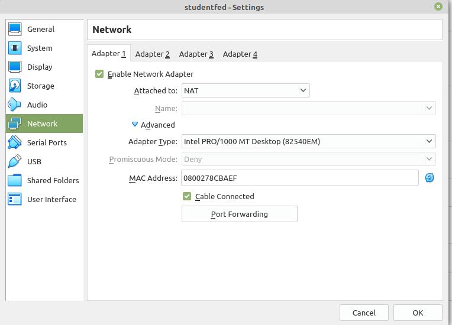
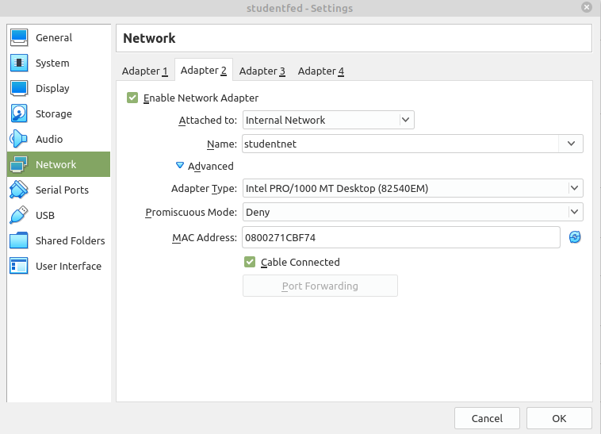
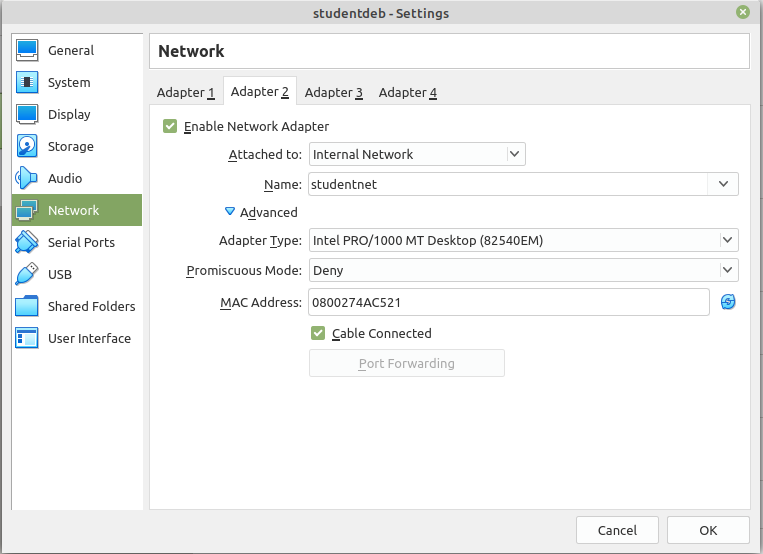

## Aanmaken van extra netwerk

Beide VM's kregen (by default) 1 netwerkadapter (en NIC) om te
connecteren aan de buitenwereld.

Zoals je ziet hieronder wordt hiervoor een NAT-adapter voorzien zodat er

* (Virtualbox) private addressen worden iutgedeeld
* De "NATTING" of vertaalslag wordt gedaan net zoals het in een klassieke (IPV4) situatie gebeurd.

### Setup internal network

De **bedoeling** echter is dat we onze **2 VM's** met elkaar laten
praten via een intern netwerk.

Om dit te kunnen doen kan je via Virtualbox een intern netwerk (of
alternatiefeen host-only network) aanmaken.

Om dit te kunnen doen enable je voor beide VM's een 2de adapter zoals je
hieronder ziet.

Om beide VM's op het zelfde netwerk te hangen typ je dezelfde naam, je
kiest hiervoor de naam **studentnet** zoals hieronder geillustreerd voor
de beide devices.

Voor **studentfed**:

en voor **studentdeb** doe je exact **hetzelfde**

### Testen

We zien op beide VM's een nieuwe NIC verschijnen.  
Op studentfed is dit enp0s8, we zien wel via het commando "ip a" dat deze niet by default wordt aangezet.

~~~
[student@fedora ~]$ ip a
1: lo: <LOOPBACK,UP,LOWER_UP> mtu 65536 qdisc noqueue state UNKNOWN group default qlen 1000
    link/loopback 00:00:00:00:00:00 brd 00:00:00:00:00:00
    inet 127.0.0.1/8 scope host lo
       valid_lft forever preferred_lft forever
    inet6 ::1/128 scope host 
       valid_lft forever preferred_lft forever
2: enp0s3: <BROADCAST,MULTICAST,UP,LOWER_UP> mtu 1500 qdisc fq_codel state UP group default qlen 1000
    link/ether 08:00:27:8c:ba:ef brd ff:ff:ff:ff:ff:ff
    inet 10.0.2.15/24 metric 1024 brd 10.0.2.255 scope global dynamic enp0s3
       valid_lft 86278sec preferred_lft 86278sec
    inet6 fe80::a00:27ff:fe8c:baef/64 scope link 
       valid_lft forever preferred_lft forever
3: enp0s8: <BROADCAST,MULTICAST> mtu 1500 qdisc noop state DOWN group default qlen 1000
    link/ether 08:00:27:1c:bf:74 brd ff:ff:ff:ff:ff:ff
~~~

Om deze link op te starten gebruik je onderstaand commando

~~~
[student@fedora ~]$ sudo ip link set enp0s8 up
[student@fedora ~]$ ip a
1: lo: <LOOPBACK,UP,LOWER_UP> mtu 65536 qdisc noqueue state UNKNOWN group default qlen 1000
    link/loopback 00:00:00:00:00:00 brd 00:00:00:00:00:00
    inet 127.0.0.1/8 scope host lo
       valid_lft forever preferred_lft forever
    inet6 ::1/128 scope host 
       valid_lft forever preferred_lft forever
2: enp0s3: <BROADCAST,MULTICAST,UP,LOWER_UP> mtu 1500 qdisc fq_codel state UP group default qlen 1000
    link/ether 08:00:27:8c:ba:ef brd ff:ff:ff:ff:ff:ff
    inet 10.0.2.15/24 metric 1024 brd 10.0.2.255 scope global dynamic enp0s3
       valid_lft 86200sec preferred_lft 86200sec
    inet6 fe80::a00:27ff:fe8c:baef/64 scope link 
       valid_lft forever preferred_lft forever
3: enp0s8: <BROADCAST,MULTICAST,UP,LOWER_UP> mtu 1500 qdisc fq_codel state UP group default qlen 1000
    link/ether 08:00:27:1c:bf:74 brd ff:ff:ff:ff:ff:ff
    inet6 fe80::a00:27ff:fe1c:bf74/64 scope link 
       valid_lft forever preferred_lft forever

[student@fedora ~]$ 
~~~

We zien dat er automatisch een link-local ipv6 wordt aangemaakt dat we kunnen gebruiken om te testen.  
Aan de studentdeb-kant voeren we dezelfde procedure uit, per toeval zien we dat hier de zelfde NIC-naam wordt gekozen...

~~~
student@studentdeb:~$ ip a
1: lo: <LOOPBACK,UP,LOWER_UP> mtu 65536 qdisc noqueue state UNKNOWN group default qlen 1000
    link/loopback 00:00:00:00:00:00 brd 00:00:00:00:00:00
    inet 127.0.0.1/8 scope host lo
       valid_lft forever preferred_lft forever
    inet6 ::1/128 scope host 
       valid_lft forever preferred_lft forever
2: enp0s3: <BROADCAST,MULTICAST,UP,LOWER_UP> mtu 1500 qdisc pfifo_fast state UP group default qlen 1000
    link/ether 08:00:27:33:7a:d1 brd ff:ff:ff:ff:ff:ff
    inet 10.0.2.15/24 brd 10.0.2.255 scope global dynamic enp0s3
       valid_lft 86386sec preferred_lft 86386sec
    inet6 fe80::a00:27ff:fe33:7ad1/64 scope link 
       valid_lft forever preferred_lft forever
3: enp0s8: <BROADCAST,MULTICAST> mtu 1500 qdisc noop state DOWN group default qlen 1000
    link/ether 08:00:27:4a:c5:21 brd ff:ff:ff:ff:ff:ff
~~~

We starten deze ook op...

~~~
root@studentdeb:~# sudo ip link set enp0s8 up
root@studentdeb:~# ip a
1: lo: <LOOPBACK,UP,LOWER_UP> mtu 65536 qdisc noqueue state UNKNOWN group default qlen 1000
    link/loopback 00:00:00:00:00:00 brd 00:00:00:00:00:00
    inet 127.0.0.1/8 scope host lo
       valid_lft forever preferred_lft forever
    inet6 ::1/128 scope host 
       valid_lft forever preferred_lft forever
2: enp0s3: <BROADCAST,MULTICAST,UP,LOWER_UP> mtu 1500 qdisc pfifo_fast state UP group default qlen 1000
    link/ether 08:00:27:33:7a:d1 brd ff:ff:ff:ff:ff:ff
    inet 10.0.2.15/24 brd 10.0.2.255 scope global dynamic enp0s3
       valid_lft 86320sec preferred_lft 86320sec
    inet6 fe80::a00:27ff:fe33:7ad1/64 scope link 
       valid_lft forever preferred_lft forever
3: enp0s8: <BROADCAST,MULTICAST,UP,LOWER_UP> mtu 1500 qdisc pfifo_fast state UP group default qlen 1000
    link/ether 08:00:27:4a:c5:21 brd ff:ff:ff:ff:ff:ff
    inet6 fe80::a00:27ff:fe4a:c521/64 scope link tentative 
       valid_lft forever preferred_lft forever
root@studentdeb:~# 
~~~

We zien dat ook een ipv6-address wordt gegenereerd.  
We kunnen nu op basis van deze local-link-adressen even testen

~~~
root@studentdeb:~# ping fe80::a00:27ff:fe1c:bf74%enp0s8
PING fe80::a00:27ff:fe1c:bf74%enp0s8(fe80::a00:27ff:fe1c:bf74%enp0s8) 56 data bytes
64 bytes from fe80::a00:27ff:fe1c:bf74%enp0s8: icmp_seq=1 ttl=64 time=1.84 ms
64 bytes from fe80::a00:27ff:fe1c:bf74%enp0s8: icmp_seq=2 ttl=64 time=1.16 ms
64 bytes from fe80::a00:27ff:fe1c:bf74%enp0s8: icmp_seq=3 ttl=64 time=0.895 ms
64 bytes from fe80::a00:27ff:fe1c:bf74%enp0s8: icmp_seq=4 ttl=64 time=1.73 ms
64 bytes from fe80::a00:27ff:fe1c:bf74%enp0s8: icmp_seq=5 ttl=64 time=1.02 ms
^C
--- fe80::a00:27ff:fe1c:bf74%enp0s8 ping statistics ---
5 packets transmitted, 5 received, 0% packet loss, time 4004ms
rtt min/avg/max/mdev = 0.895/1.327/1.843/0.384 ms
root@studentdeb:~# 
~~~

~~~
[student@fedora ~]$ ping fe80::a00:27ff:fe4a:c521%enp0s8
PING fe80::a00:27ff:fe4a:c521%enp0s8(fe80::a00:27ff:fe4a:c521%enp0s8) 56 data bytes
64 bytes from fe80::a00:27ff:fe4a:c521%enp0s8: icmp_seq=1 ttl=64 time=0.441 ms
64 bytes from fe80::a00:27ff:fe4a:c521%enp0s8: icmp_seq=2 ttl=64 time=0.568 ms
64 bytes from fe80::a00:27ff:fe4a:c521%enp0s8: icmp_seq=3 ttl=64 time=0.523 ms
64 bytes from fe80::a00:27ff:fe4a:c521%enp0s8: icmp_seq=4 ttl=64 time=0.473 ms
64 bytes from fe80::a00:27ff:fe4a:c521%enp0s8: icmp_seq=5 ttl=64 time=0.520 ms
^C
--- fe80::a00:27ff:fe4a:c521%enp0s8 ping statistics ---
5 packets transmitted, 5 received, 0% packet loss, time 4078ms
rtt min/avg/max/mdev = 0.441/0.505/0.568/0.043 ms
[student@fedora ~]$ 
~~~