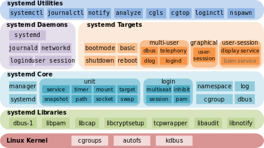

## systemd

Zoals we eerder hadden gezien wordt een GNU/Linux opgestart via onderstaand schema

~~~
+---------------------+
|  1ST BOOTLOADER     | (bv. BIOS/UEFI)
+----------+----------+
           |
+----------v----------+
|  2ND BOOTLOADER     |  (bv. GRUB, UBoot)
+----------+----------+
           |
+----------v----------+
|        KERNEL       |  => PID 0
+----------+----------+
           |
+----------v----------+
|         INIT        |  => PID 1 (bv. systemd, init, system-v, ...)
+----------+----------+
           |
+----------v----------+
|       RUNLEVEL      |
+---------------------+
~~~

Op de moment dat de kernel is opgestart zal deze het feitelijk Operating Systeem opstarten dat je als eindgebruiker zult gebruiken.

Dit doet de kernel door het eerste process op te starten in userspace via **/sbin/init**.

Als je gaat zien naar deze link zie je dat het een "soft/symbolic link" of door verwijzing naar **systemd**

> Nota: Op embedded systemen zal je ook andere init-systemen zien

~~~
bart@bvlegion:~$ ls -l /sbin/init 
lrwxrwxrwx 1 root root 20 Apr 21 14:54 /sbin/init -> /lib/systemd/systemd
bart@bvlegion:~$ 
~~~

systemd is een system- en services-manager en een volgt het vroegere SysVinit dat nog dateerde van uit Unix-periode.  
Dit houdt in dat het onder andere:

* Start daemons (services) op
* Kijkt hier ook na in welke volgorde (en dependencies)
* Geeft de mogelijkheid om deze on-demand te stoppen en starten
* Heeft een specifiek journaling journald dat syslog vervangt
* Voorziet in vervanging van een aantal bestaande tools (zoals bijvoorbeeld systemd-timers ipv cron)
* ...

### Belangrijkste commando's

~~~
# systemctl start [name.service]
# systemctl stop [name.service]
# systemctl restart [name.service]
# systemctl reload [name.service]
$ systemctl status [name.service]
# systemctl is-active [name.service]
$ systemctl list-units --type service --all
~~~

Naast service zijn er nog 11 andere unit-types

* Target: group of units
* Automount: filesystem auto-mountpoint
* Device: kernel device names, which you can see in sysfs and udev
* Mount: filesystem mountpoint
* Path: file or directory
* Scope: external processes not started by systemd
* Slice: a management unit of processes
* Snapshot: systemd saved state
* Socket: IPC (inter-process communication) socket
* Swap: swap file
* Timer: systemd timer.
