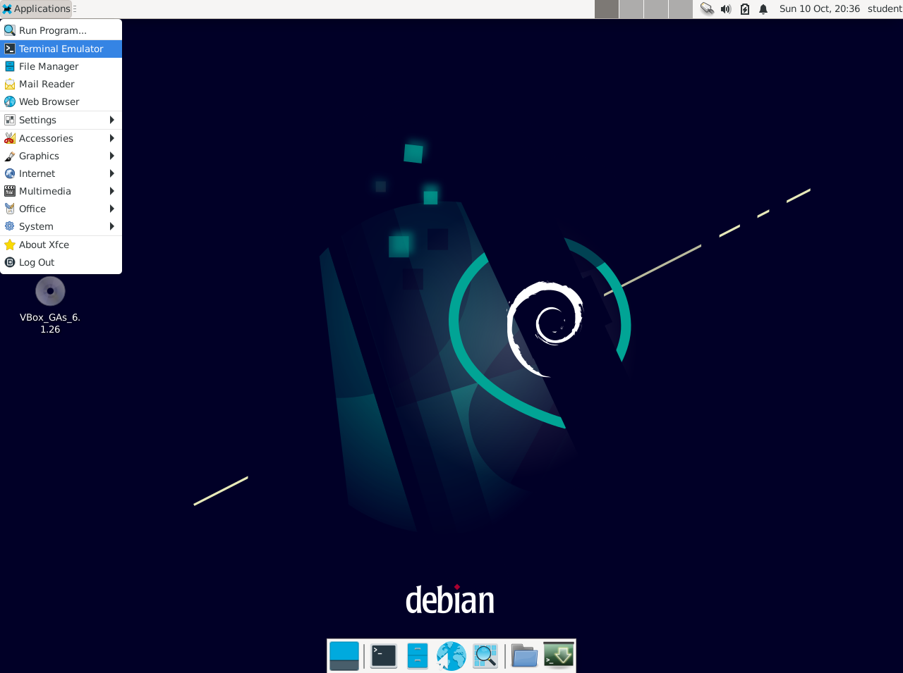
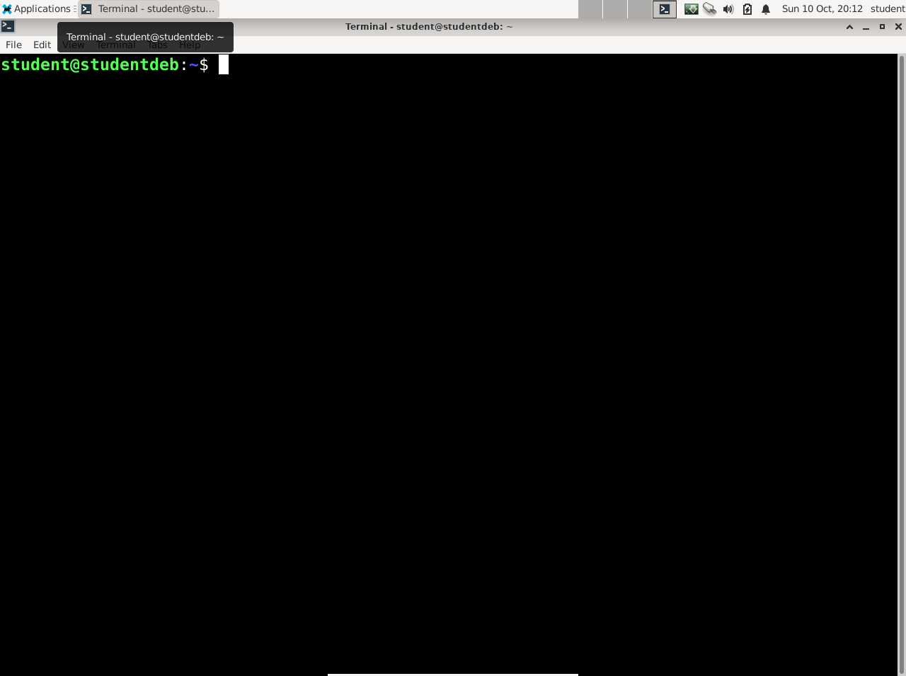
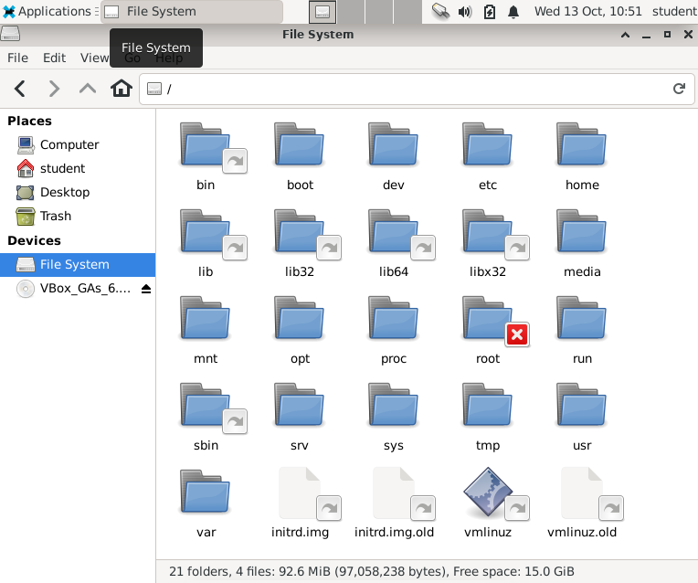
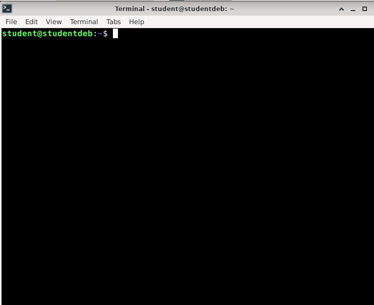

## Werken met een shell (Bash)

### Command-Line in Linux

Een **"command line"** is een **tekst-georienteerde interface** die kan worden gebruikt om **diverse taken** binnen een **besturingssysteem uit te voeren**.  

De **command-line voor Linux** wordt geleverd door een **toepassing** die we de **shell** wordt genoemd.  

Op je Linux-systeem zal het je toelaten alle soorten administratie-**taken** uit te voeren op je computer:

* **Files** en **folders** te bewerken
* Je besturingssysteem te **configureren**
* **Programma**'s op te **starten**
* Met een **netwerk** te interageren
* Taken te **automatiseren**
* ...

> *Nota*  
> In Windows heb je als command-line-toepassing Bash of Powershell.  

Een groot deel van de activiteiten die we gaan uitvoeren in Linux vereisen een goede kennis van de bash-terminal.  

Het is dus zeer belangrijk deze goed onder de knie te krijgen en dat is wat in dit hoofdstuk zullen starten...

### Bash

De standaard shell voor gebruikers in Debian (maar ook veel andere Linux-distributies) is de **GNU Bourne-Again Shell** of afgekort **Bash**.  

Bash is een **verbeterde versie** van een van de meest succesvolle shells die wordt gebruikt op UNIX-achtige systemen, de **Bourne Shell** (sh).

#### Bash-shell openen

Laten we **van start gaan**...
Om een shell te openen vanuit een GUI bestaat er binnen Linux diverse **terminal-programma's** of **emulators**.  

Om deze te openen binnen onze Linux-distro (Debian met Xfce) **selecteer** je binnen het menu **"Terminal Emulator"**:



Vervolgens krijg je een **terminal-console** waar in je **commando's kan ingeven/uitvoeren**.



#### Shell-sessie

Via zo'n **emulator/console** gaan we de **shell** als user **interactief** gaan gebruiken (later gaan we deze ook gebruiken via scripting).

Nu deze console is geopend we van een **shell-sessie** (of bash-sessie om precies te zijn).  
Dit is een programma dat **wacht** op **commando's** die je ingeeft en deze uitvoert als je op **enter** typt.

De shell zal vervolgens wachter tot dit commando (of job) is uitgevoerd (tenzij dat je het als background-taak uitvoert) en de output van deze job uitvoeren.

Volgende taak zal bijvoorbeeld de inhoud van je huidige work-directory afprinten:

~~~
student@studentdeb:~$ ls
Desktop  Documents  Downloads  Music  Pictures  Public  Templates  Videos
student@studentdeb:~$
~~~

#### Shell-prompt

Als je de **console** start verschijnt er een een stuk **tekst**, dat er ongeveer zo moeten uit zien:  

~~~bash
student@studentdeb:~ $
~~~

> *Nota:*  
> Deze console kan verschillen tussen verschillende linux distributies.  
> Over het algemeen zullen deze echter dicht bij komen.


Dit is wat we noemen de **prompt** (of shell- of user-prompt), deze :

* geeft mee welke **user** ingelogd is (bart)
* geeft aan wat het huidige **path** - of **working directory** - momenteel is gereferenceerd (~)
  (in dit geval komt ~ overeen met de home-directory van de user)
* geeft je mogelijkheid om een **commando** in te typen

Het dollar-teken ($) aan het einde is het einde van de prompt en geeft aan dat je commando's kan ingeven.  

> *Nota:*  
> Naast deze **default-prompt** gaan we verderop in de cusus nog zien dat ook nog een **superuser-prompt**, deze eindigt met een \# ipv een $, deze wordt gebruikt wanneer je wijzigingen aan het systeem wil aanbrengen met root-access (we komen hier weldra nog op terug)

### Commando's in de shell

Deze prompt geeft aan dat je dus een aantal commando's kan ingeven, laten we starten een aantal keren op de **return- of enter-toets** te duwen.

~~~
student@studentdeb:~$ 
student@studentdeb:~$ 
student@studentdeb:~$ 
~~~

Als je **niets typt** na de prompt en op enter drukt, dan gebeurt er niets en krijg je een **nieuwe prompt** onder de oude prompt.

Als je terug **1 prompt wil zien** dan kan je het **commando** **clear** typen (gevolgd door een enter):

~~~
student@studentdeb:~$ 
student@studentdeb:~$ 
student@studentdeb:~$ clear
~~~

Vervolgens zie je dat je terug 1 user-prompt ziet...

~~~
student@studentdeb:~$ 
~~~

Hetzelfde kan je bereiken via de key-combo "Ctrl+L"

#### Commando-Argumenten

Zo'n **commando** is telkens een **programma** dat wordt **uitgevoerd**, zelfs het éénvoudige programma clear dat we zo net hebben gebruikt.

Veel van deze programma's hebben echter een **argument** nodig.  
Laten we direct illustreren via een **2de commando** gebruiken, **echo**

~~~
student@studentdeb:~$ echo hello
hello
student@studentdeb:~$ 
~~~

Dit **commando** heeft als **functie** een stuk **tekst** **af te drukken** naar de **console**.  

Het stuk tekst dat je wil afdrukken kan je dan 
gewoon aan dit programma meegeven als **argument**.

Een **argument** volgt direct op het commando met dus volgende **vormfactor**:

~~~
[command] [arguments]
~~~

Zoals hierboven aangegeven kan het zijn dat je meer dan 1 argument meegeeft aan een commando.  
Dat zullen we later nog zien bij andere commando's...

#### Commando-opties

Naast argumenten kan je ook nog extra **opties** meegeven.  
Dit zijn **extra** opties (meestal niet verplicht) die je kan meegeven aan zo'n **commando** om het gedrag een te **beïnvloeden**.  
Deze opties zijn meestal **voorafgegaan** door een **streepje** (- of ook hyphen genoemd).  

Bijvoorbeeld, het echo-commando zal de tekst afdrukken maar daarna ook onmiddellijk een nieuwe lijn afdrukken.  
Je kan dit gedrag wijzigen (geen nieuwe lijn afdrukken) door de **optie "-n"** mee te geven:

~~~
student@studentdeb:~$ echo -n hello
hellostudent@studentdeb:~$ 
~~~

Deze drukt dus nog altijd de tekst af, maar in **tegenstelling** tot hieronder (zonder optie) zal deze **geen nieuwe lijn** afdrukken.

~~~
student@studentdeb:~$ echo hello
hello
student@studentdeb:~$ 
~~~

#### Linux commando's => vormfactor

De meeste Linux (en Unix-programma's) gebruiken dan ook de volgende vormfactor:

Na de commando-naam volgen dan 1 of meerder opties (telkens voorafgegaan door en een streepje) en dan pas op het einde gevolgd door argumenten.  

~~~
[command] [options] [arguments]
~~~

Deze opties zijn meestal afkortingen en bestaan uit (meestal) 1 karakter na het streepje.  
Zo'n korte optie noemen we een **"SHORT-OPTION"**.

#### SHORT en LONG-options

Soms heb je echter zowel een **SHORT**- als een **LONG**-option.  
Zo'n **LONG-option** wordt voorafgegaan door 2 streepjes (-- double hyphen)

Soms heb je echter ook nog een langere versie of "long-option" zo'n optie.  
Bij voorbeeld bij het commando ls dat je gebruikt om de inhoud van een directory te bekijken (zie ook eerder) heb je een optie "--all" waarmee je ook verborgen bestanden kan kijken.

"--all" is hier een leesbaardere "LONG-option"

~~~
student@studentdeb:~$ ls --all
.              .mozilla
..             Music
.bash_history  Pictures
.bash_logout   .profile
.bashrc        Public
.cache         Templates
.config        .vboxclient-clipboard.pid
Desktop        .vboxclient-display-svga-x11.pid
.dmrc          .vboxclient-draganddrop.pid
Documents      .vboxclient-seamless.pid
Downloads      Videos
.gnupg         .Xauthority
.ICEauthority  .xsession-errors
.lesshst       .xsession-errors.old
.local
~~~

Je kan echter daarnaast met een kortere "SHORT-options" trouwens net hetzelfde doen...

~~~
student@studentdeb:~$ ls -a
.              .mozilla
..             Music
.bash_history  Pictures
.bash_logout   .profile
.bashrc        Public
.cache         Templates
.config        .vboxclient-clipboard.pid
Desktop        .vboxclient-display-svga-x11.pid
.dmrc          .vboxclient-draganddrop.pid
Documents      .vboxclient-seamless.pid
Downloads      Videos
.gnupg         .Xauthority
.ICEauthority  .xsession-errors
.lesshst       .xsession-errors.old
.local

~~~

### Shortcuts en shell-acties

Binnen een bash-shell heb je een aantal features en shortcuts die je het leven gemakkelijk kunnen maken.

#### Teruggaan in de historiek

Zo'n eerste feature is dat een shell de **historiek** van je commando's onthoudt.  

Om commando's te hergebruiken - die je eerder had ingegeven - kan je de **pijltjes-toetsen** gebruiken om eerder gebruikte commando's opnieuw op de console te tonen.

Stel dat je 2 commando's na elkaar uitvoert:

* "ls" => Oplijsten van de inhoud van de HOME-directory
* "cd Desktop" => Navigeren naar de Desktop-directory

Krijg je volgend resultaat:

~~~
student@studentdeb:~$ ls
Desktop  Documents  Downloads  Music  Pictures  Public  Templates  Videos
student@studentdeb:~$ cd Desktop/
student@studentdeb:~/Destop$
~~~

Als je vervolgens het up-pijltje van je keyboard indrukt kan je terug het meest recente commando naar boven brengen.

~~~
student@studentdeb:~$ ls
Desktop  Documents  Downloads  Music  Pictures  Public  Templates  Videos
student@studentdeb:~$ cd Desktop/
student@studentdeb:~/Desktop$ cd Desktop/
~~~

Als je dit een 2de maal indrukt krijg je het commando ls.  

~~~
student@studentdeb:~$ ls
Desktop  Documents  Downloads  Music  Pictures  Public  Templates  Videos
student@studentdeb:~$ cd Desktop/
student@studentdeb:~/Desktop$ ls
~~~

Als je dan vervolgens op de enter-toets drukt wordt dat commando uitgevoerd.

~~~
student@studentdeb:~$ ls
Desktop  Documents  Downloads  Music  Pictures  Public  Templates  Videos
student@studentdeb:~$ cd Desktop/
student@studentdeb:~/Desktop$ ls
student@studentdeb:~/Desktop$ 
~~~

#### Tab-completion

~~~
student@studentdeb:~/Desktop$ e
echo                   encguess               exfalso
edit                   enchant-2              exit
editor                 enchant-lsmod-2        exo-desktop-item-edit
editres                env                    exo-open
egrep                  envsubst               expand
eject                  eqn                    expiry
elif                   esac                   export
else                   eval                   expr
enable                 ex                     
enc2xs                 exec                   
student@studentdeb:~/Desktop$ ec 
~~~

Als je dan vervolgens er een c (na de e) typt

~~~
...                 
student@studentdeb:~/Desktop$ ec
~~~

En opnieuw de tab tikt dan zal de bash-shell het commando geven (gezien dat dit not het enige is)

~~~
...                 
student@studentdeb:~/Desktop$ echo
~~~

#### Programma beëindigen met Ctrl+C

Soms kan het zijn dat je een commando intikt dat niet van zich zelf zal stoppen (bedoeld of onbedoeld).

Stel bijvoorbeeld dat je het volgende commando type

~~~
$ cat /dev/random
... heel wat rommel op je schermt...
$
~~~

Dit zal heel wat rommel op je console afdrukken (en zal niet van zichzelf stoppen).

Als je echter **Ctrl+C** typt kan je dit programma beëindigen en terug beschikking hebben over de shell.

Dit key-combinatie zal een **interrupt-signaal** doorsturen naar de applicatie en er voor zorgen dat deze wordt afgesloten.

> *Nota*:  
> Hoewel dit zal werken voor de meeste programma's
> kan een programma dit interrupt-signaal opvangen
> (en dus negeren).  
> In dat geval zijn er nog andere manieren om een 
> job af te sluiten.  
> We komen hier in het gedeelte rond jobs en processen nog 
> op terug (waar we ook wat meer diepgang zullen meegeven over
> deze signalen).  
> Voorlopig is het voldoende te weten dat Ctrl+C een
> programma kan onderbreken

#### Afluiten met Ctrl+D (of het exit-commando)

Als je de shell **sessie** wil **afsluiten** kan je dit doen met het **exit** commando of de key-combinatie **Ctrl-D** 

### Files en directories

Net zoals de meeste besturingssystemen heeft Linux 2 belangrijke elementen om informatie bij te houden en te structureren:

* Files (bestanden)
* Directories (folders/mapjes)

#### Geen C-schijf...

De structuur van een Linux-filesystem (bestandssysteem) verschilt wel enigszins van wat de meesten gewoon zijn onder Windows.  

Linux heeft geen **fysieke schijf** (zoals de C: schijf) aan de basis van het filesysteem.  
In plaats daarvan wordt er een **logisch bestandssysteem** gebrukt.  



Helemaal bovenaan het filesystem-structuur is **/**, men noemt dit meestal ook **root** van het **bestandssysteem** (niet te verwarren met de root-user).  

#### Linux File Hierarchy

Onder deze root bevinden zich een hele hoop directories en bestanden hiërarchisch geordend (een beetje zoals een wortel-systeem)

~~~
/ ──+
    ├── bin -> usr/bin (link)
    ├── boot
    ├── dev
    ├── etc
    └── home
          └── student
          └── bart
    ├── media
    ├── mnt
    ├── opt
    ├── proc
    ├── root
    ├── run
    ├── sbin -> usr/sbin (link)
    ├── srv
    ├── sys
    ├── tmp
    └── usr
        ├── bin
        ├── include
        ├── lib
        ├── local
        └── sbin
    └── var
~~~

Direct onder deze root-directory bevinden zich een aan systeem-directories.  
Deze bevatten software, libraries, scripts, configuratie-bestanden, ...

* **/etc/** => **configuraties** van het systeem
* **/boot/** => **kernel** en andere **boot-files**
* **/run/** => **data** ivm **processen**, geopende files, ...
* **/usr/** => geinstalleerde **software**, applicaties, libraries
* **/root/** => **home**-directory voor de **superuser** (niet binnen /home/)
* **/tmp/** => **tijdelijke files** (wordt regelmatig opgekuist)
* **/var/** => variabele data die wel moet worden opgeslagen tussen boots
* **/bin/** en /sbin => shortcuts naar gelijnamige directories binnen /usr
* **/dev/** => bevat speciale **"device"-files** gebruikt om met hardware te connecteren
* ...

Als je in detail wil weten waar elke van deze directories voor wordt gebruikt kan je gebruik maken van het command "man hier"

#### Filepath

Zoals eerder vermeld, de directory **/** of **root** is de **hoofd-directory** bovenaan de **hiërarchie** van het bestandssysteem.  

Dit **/-karakter** wordt ook gebruikt als scheidingsteken in een **path** (pad).  
Dit **path** gebruik je zoals een address binnen een command-line of script om een bestand of filename te lokaliseren.  

Bijvoorbeeld het filepath naar de directory /home/student/Desktop geeft aan dat:

* **Desktop** een **subdirectory** is van **student**
* **student** van **home** (op zijn beurt)
* **home** van de **root**-directory

~~~
  / 
  └── home
        ├── bart
        └── student
              └── Desktop
~~~

Onder deze verschillende **directories** kan je dan bestanden plaatsen.  
Deze bestanden kan je dan gemakkelijk terugvinden en **adresseren** via een path, we noemen dit ook soms wel een **filepath**.

We **breiden** bovenstaand **voorbeeld** uit door files te **plaatsen** onder deze **directories**.
Als je bijvoorbeeld het bestand sensors.json wil gebruiken...

~~~
  / 
  └── home
        ├── bart
        └── student
              ├── hello.csv
              ├── test.xml
              └── data
                    └── sensors.json
~~~

... kan dit via het **path** **/home/student/data/sensors.json**

Dit is wat we noemen een **absoluut path**, een adressering vanaf de root-directory.  
Naast een absoluut path bestaat er ook nog een **relatief** path, daar komen we zo dadelijk nog op terug. 

#### Working-directory

We starten met het aanmaken van een **directory** waarin we onze C-code gaan plaatsen.  
We starten vanuit de volgende hiërarchie die automatisch zou moeten zijn aangemaakt na de installatie:

> *Nota:*  
> Er vanuitgaande dat je student als user-name hebt gekozen zoals gevraagd...

~~~
  / 
  └── home
        └── student
              ├── Desktop
              └── Documents
~~~

Als je de command-line opent krijg je volgende shell:



Als je een interactieve shell of command-line start deze zich in een specifiek directory.  
Je kan weten waar je exact aan het werken bent via het commando **pwd** ofwel "**pr**int **w**orking **d**irectory" welk aangeeft welke je actieve of **working**-directory is

~~~
student@studentdeb:~$ pwd
/home/student
student@studentdeb:~$ 
~~~

#### Inhoud tonen met ls

Onder GNU/Linux (en andere unix-varianten) is **ls** ofwel "**l**i**s**t) een commando om de inhoud van een directory weer te geven.  

~~~
student@studentdeb:~$ ls
Desktop  Documents  Downloads  Music  Pictures  Public  Templates  Videos
student@studentdeb:~$ 
~~~

Zonder argumenten wordt de inhoud van de werkdirectory (= huidige directory) getoond.  
Als je de inhoud wil tonen van een subdirectory kan je deze als argument gebruiken:

~~~
student@studentdeb:~$ ls Documents/
hello  myhistory  tweedehistory
~~~

Als je meer details te weten wil komen kan je ls met de **optie -l** combineren:

~~~
student@studentdeb:~$ ls -l Documents/
total 12
drwxr-xr-x 2 student student 4096 Sep 29 20:24 hello
-rw-r--r-- 1 student student 3063 Sep 29 21:33 myhistory
-rw-r--r-- 1 student student 2794 Sep 29 21:16 tweedehistory
~~~

Dit toont meer volledige info zoals:

* type van item
  * **d** staat voor directory
  * **\-** voor een gewone file
* permissies (zie hoofdstuk rond users en permissies)
* user en group (zie hoofdstuk rond users en permissies)
* tijd van laatste aanpassing
* size
* ...

Een aantal andere opties die handig kunnen zijn:

* \-S: sorteer op bestandsgrootte
* \-t: sorteer op tijd
* \-r: draai de volgorde om (van het sorteren)
* \-R: recursief, geef ook de inhoud van de subdirectory('s) weer
* \-a: geef ook verborgen bestanden weer (die beginnen met een punt)
* \-d: geef bij directory-items niet de inhoud ervan weer, maar slechts de directorynaam zelf

#### Navigeren met cd

Je kan deze **working-directory** ook **wijzigen** met het commando **cd** ofwel "**c**hange **d**irectory

~~~
student@studentdeb:~$ cd Documents/
student@studentdeb:~/Documents$ pwd
/home/student/Documents
student@studentdeb:~/Documents$ ls -l
total 12
drwxr-xr-x 2 student student 4096 Sep 29 20:24 hello
-rw-r--r-- 1 student student 3063 Sep 29 21:33 myhistory
-rw-r--r-- 1 student student 2794 Sep 29 21:16 tweedehistory
~~~

##### Super-directory

Als je naar een hogere directory (of de **super-directory**) wil navigeren kan je de placeholder **..** hiervoor gebruiken.

~~~
student@studentdeb:~/Documents$ cd ..
student@studentdeb:~$ pwd
/home/student
student@studentdeb:~$ ls -l
total 32
drwxr-xr-x 2 student student 4096 Sep 26 20:49 Desktop
drwxr-xr-x 3 student student 4096 Oct 10 20:48 Documents
drwxr-xr-x 2 student student 4096 Sep 26 20:49 Downloads
drwxr-xr-x 2 student student 4096 Sep 26 20:49 Music
drwxr-xr-x 2 student student 4096 Sep 26 20:49 Pictures
drwxr-xr-x 2 student student 4096 Sep 26 20:49 Public
drwxr-xr-x 2 student student 4096 Sep 26 20:49 Templates
drwxr-xr-x 2 student student 4096 Sep 26 20:49 Videos
student@studentdeb:~$ ls ..
student
student@studentdeb:~$
~~~

Je kan ook **meerdere niveaus** naar boven verwijzen mits je deze **..** scheidt door een **/**

~~~
student@studentdeb:~$ ls ../..
bin   home            lib32       media  root  sys  vmlinuz
boot  initrd.img      lib64       mnt    run   tmp  vmlinuz.old
dev   initrd.img.old  libx32      opt    sbin  usr
etc   lib             lost+found  proc   srv   var
student@studentdeb:~$ 
~~~

##### Vorige directory

Een handige **shortcut** (bij cd) is de **combinatie** van **cd** met een **hyphen** (streepje).  
Als je volgend commando uitvoert...

~~~
student@studentdeb:~$ cd -
/home/student/Documents
student@studentdeb:~/Documents$ 
~~~

...keer je terug naar de **vorige working-directory** die je gebruikte in je shell-sessie

#### HOME-directory

/home/student/ is de **HOME-directory**, net zoals je onder Windows een home-directory "C:\Users\student" zou hebben.  

Als je inlogt in een shell-venster kom je automatisch terecht in deze home directory.  
Als je van een andere working-directory echter terug naar je HOME-directory wil navigeren kan je cd gebruiken zonder argument.

~~~
student@studentdeb:~/Documents$ pwd
/home/student/Documents
student@studentdeb:~/Documents$ cd
student@studentdeb:~$ pwd
/home/student
student@studentdeb:~$ 
~~~

Er zijn nog **2 andere shortcuts** om naar de **HOME-directory** te verwijzen

* De environment-variabele **$HOME**
* Een tilde of ~ 

Deze kan je bijvoorbeeld gebruiken om de lijst van files te tonen van je home-directory (vanuit een andere directory)

~~~
student@studentdeb:~/Documents$ ls
hello  myhistory  tweedehistory
student@studentdeb:~/Documents$ ls ~
Desktop  Documents  Downloads  Music  Pictures  Public  Templates  Videos
student@studentdeb:~/Documents$ ls $HOME
Desktop  Documents  Downloads  Music  Pictures  Public  Templates  Videos
student@studentdeb:~/Documents$ 
~~~

#### Een directory aanmaken

Na het navigeren volgt het aanmaken van directories en files.  
We gaan volgende bestanden aanmaken:

~~~
  / 
  └── home
        ├── bart
        └── student
              ├── hello.csv
              ├── test.xml
              └── data
                    └── sensors.json
~~~

We starten met de directory data aan te maken:

~~~
student@studentdeb:~$ mkdir data
student@studentdeb:~$ ls -l
total 36
drwxr-xr-x 2 student student 4096 Oct 13 13:04 data
drwxr-xr-x 2 student student 4096 Sep 26 20:49 Desktop
drwxr-xr-x 3 student student 4096 Oct 10 20:48 Documents
drwxr-xr-x 2 student student 4096 Sep 26 20:49 Downloads
drwxr-xr-x 2 student student 4096 Sep 26 20:49 Music
drwxr-xr-x 2 student student 4096 Sep 26 20:49 Pictures
drwxr-xr-x 2 student student 4096 Sep 26 20:49 Public
drwxr-xr-x 2 student student 4096 Sep 26 20:49 Templates
drwxr-xr-x 2 student student 4096 Sep 26 20:49 Videos
student@studentdeb:~$ 
~~~

**mkdir** gevolg door het path **data** nieuwe directory of folder aan.  

Zonder argumenten kan je enkel **1 niveau van folder** aanmaken, stel dat je bijvoorbeeld een parent en child-folder in 1 maal wil aanmaken gaat dit niet zomaar:

~~~
student@studentdeb:~$ mkdir hello/world
mkdir: cannot create directory ‘hello/world’: No such file or directory
~~~

Als je echter de optie -p meegeeft zullen de parent-folders (hello in dit geval) mee worden  aangemaakt als deze nog niet mochten bestaan:

~~~
student@studentdeb:~$ mkdir -p hello/world
student@studentdeb:~$ ls hello
world
student@studentdeb:~$ ls -l hello
total 4
drwxr-xr-x 2 student student 4096 Oct 13 13:07 world
student@studentdeb:~$ 
~~~

#### Relatieve vs absolute path

*mkdir* en *cd* nemen - net zoals de meeste commando's op de DOS-prompt - als input een **path**.    
Zo'n path is de verwijzing naar een (target-)directory waarop je dit commando wil op uitvoeren.  

Er zijn een aantal manieren waarop je een path kan construeren, het grootste onderscheid dat we hier maken is  absoluut of relatief:

* **absoluut** is een path dat start vanaf de root-directory, dit path start namelijk vanaf de schijf waar je wil naar verwijzen

~~~
student@studentdeb:~$ cd /home/student/hello/world/
student@studentdeb:~/hello/world$ pwd
/home/student/hello/world
student@studentdeb:~/hello/world$ 
~~~

Dit start altijd me een verwijzing naar de root-directory

* **relatief** verwijst naar een locatie relatief naar je huidige directory

~~~
student@studentdeb:~$ cd hello/world/
student@studentdeb:~/hello/world$ pwd
/home/student/hello/world
student@studentdeb:~/hello/world$ 
~~~

Het symbool **..** (2 dots na elkaar) kan je ook gebruiken in deze relatieve paden:

~~~
student@studentdeb:~/hello/world$ cd ../../data/
student@studentdeb:~/data$ pwd
/home/student/data
~~~

Of het voorgaande substitiekarakter ~ 

~~~
student@studentdeb:~/data$ cd ~/data/
student@studentdeb:~/data$ pwd
/home/student/data
~~~

#### Een lege file aanmaken via touch

File aanmaken kan je doen met het commando **touch**

~~~
student@studentdeb:~/data$ touch sensors.json
student@studentdeb:~/data$ ls -l
total 0
-rw-r--r-- 1 student student 0 Oct 13 13:27 sensors.json
student@studentdeb:~/data$ 
~~~

Als het bestand reeds bestaat zal touch echter alleen de update-datum aanpassen:

~~~
student@studentdeb:~/data$ touch sensors.json 
student@studentdeb:~/data$ ls -l
total 0
-rw-r--r-- 1 student student 0 Oct 13 13:29 sensors.json
~~~

#### Directories en files verwijderen

Een directory kan verwijderd worden door het commando **rmdir**.  
Deze directory mag wel geen files bevatten anders zal deze een fout-code opleveren

~~~
student@studentdeb:~$ rmdir data
rmdir: failed to remove 'data': Directory not empty
~~~

Als je een directory wil deleten dien je eerst de files daarbinnen te deleten.  
Dit kan je via het commando **rm**

~~~
student@studentdeb:~$ rm data/sensors.json 
student@studentdeb:~$ ls data
student@studentdeb:~$
~~~

Eénmaal de directory leeg is kan je deze deleten via het commando rmdir

~~~
student@studentdeb:~$ rmdir data
student@studentdeb:~$ ls -l
total 36
drwxr-xr-x 2 student student 4096 Sep 26 20:49 Desktop
drwxr-xr-x 3 student student 4096 Oct 10 20:48 Documents
drwxr-xr-x 2 student student 4096 Sep 26 20:49 Downloads
drwxr-xr-x 3 student student 4096 Oct 13 13:07 hello
drwxr-xr-x 2 student student 4096 Sep 26 20:49 Music
drwxr-xr-x 2 student student 4096 Sep 26 20:49 Pictures
drwxr-xr-x 2 student student 4096 Sep 26 20:49 Public
drwxr-xr-x 2 student student 4096 Sep 26 20:49 Templates
drwxr-xr-x 2 student student 4096 Sep 26 20:49 Videos
~~~

#### Copieren van een file

Je kan ook een file via de terminal copieren via het commando cp ofwel "**c**o**p**y"

~~~bash
student@studentdeb:~$ touch test.txt
student@studentdeb:~$ cp test.txt test2.txt
student@studentdeb:~$ ls -l
total 36
...
-rw-r--r-- 1 student student    0 Oct 13 13:37 test2.txt
-rw-r--r-- 1 student student    0 Oct 13 13:36 test.txt
...
~~~

#### Copieren van een directory

Dit comando geldt ook voor directories maar als deze niet leeg zijn moet je hier de optie -r aan toevoegen

~~~bash
student@studentdeb:~$ cp Documents/ DocumentsCopy/
cp: -r not specified; omitting directory 'Documents/'
student@studentdeb:~$ cp -r Documents/ DocumentsCopy/
student@studentdeb:~$ ls -lrt
total 40
drwxr-xr-x 2 student student 4096 Sep 26 20:49 Videos
drwxr-xr-x 2 student student 4096 Sep 26 20:49 Templates
drwxr-xr-x 2 student student 4096 Sep 26 20:49 Public
drwxr-xr-x 2 student student 4096 Sep 26 20:49 Pictures
drwxr-xr-x 2 student student 4096 Sep 26 20:49 Music
drwxr-xr-x 2 student student 4096 Sep 26 20:49 Downloads
drwxr-xr-x 2 student student 4096 Sep 26 20:49 Desktop
drwxr-xr-x 3 student student 4096 Oct 10 20:48 Documents
drwxr-xr-x 3 student student 4096 Oct 13 13:07 hello
-rw-r--r-- 1 student student    0 Oct 13 13:36 test.txt
-rw-r--r-- 1 student student    0 Oct 13 13:37 test2.txt
drwxr-xr-x 3 student student 4096 Oct 13 13:39 DocumentsCopy
~~~

#### Verplaatsen van files en directories

Om een bestand of file te verplaatsen naar een directory kan je het commando **mv** ofwel **m**o**v**e gebruiken:

~~~
student@studentdeb:~$ mv hello/ Documents
student@studentdeb:~$ ls -l Documents
total 12
drwxr-xr-x 3 student student 4096 Oct 13 13:07 hello
-rw-r--r-- 1 student student 3063 Sep 29 21:33 myhistory
-rw-r--r-- 1 student student 2794 Sep 29 21:16 tweedehistory
~~~

#### Naam wijzigen van een file

Hetzelfde commando kan je ook gebruiken als je een file of directory van naam wil wijzigen.

~~~
student@studentdeb:~$ mv test.txt test
student@studentdeb:~$ ls -lrt
total 36
drwxr-xr-x 2 student student 4096 Sep 26 20:49 Videos
drwxr-xr-x 2 student student 4096 Sep 26 20:49 Templates
drwxr-xr-x 2 student student 4096 Sep 26 20:49 Public
drwxr-xr-x 2 student student 4096 Sep 26 20:49 Pictures
drwxr-xr-x 2 student student 4096 Sep 26 20:49 Music
drwxr-xr-x 2 student student 4096 Sep 26 20:49 Downloads
drwxr-xr-x 2 student student 4096 Sep 26 20:49 Desktop
-rw-r--r-- 1 student student    0 Oct 13 13:36 test
-rw-r--r-- 1 student student    0 Oct 13 13:37 test2.txt
drwxr-xr-x 3 student student 4096 Oct 13 13:39 DocumentsCopy
drwxr-xr-x 3 student student 4096 Oct 13 14:08 Documents
student@studentdeb:~$ 
~~~

### Shell vs environment-variabelen

Een shell laat toe om - zoals in een programmmeer-taal - variabelen aan te maken en te gebruiken.

#### Een shell-variabele definieren

Een shell-variabele is een **variabele** (eigenlijk een stuk tekst) die door de **shell** wordt **bijgehouden** gedurende de terminal-sessie.  

Het volgende **voorbeeld** gebruikt bijvoorbeeld dit mechanisme om een het **path** naar een **folder** bij te houden

~~~
student@studentdeb:~$ MY_DATA_FOLDER=/home/student/Documents
student@studentdeb:~$ echo $MY_DATA_FOLDER 
/home/student/Documents
student@studentdeb:~$ cd $MY_DATA_FOLDER 
student@studentdeb:~/Documents$ 
~~~

* Zo'n variabele kan je initialiseren via door de **naam** van deze variabele
* Te verbinden via een **=**-teken aan een tekst
* Je kan de inhoud van zo'n **variabele** afdrukken naar de console met het commando **echo**  
  (gevolgd door de naam voorafgegaan door een $-teken)
* Je kan de inhoud hergebruiken bij andere commando's door deze naam te laten voorgaan door een **$**-terugkomen   
  (de shell zal dan de tekst achter deze variabele vervangen)

> **Let op**, als deze variabele al bestaat dan wordt deze overschreven

#### Environment-variabelen

Een **shell-variabele** zal **enkel** **zichtbaar** zijn binnen de **shell** zelf.  
Vanaf de moment dat je een nieuwe shell start zal deze niet meer zichtbaar zijn.

Je kan echter zo'n shell-variabele "promoten" naar een environment-variabele toe, hiervoor gebruiken we het **commando export**

In onderstaand voorbeeld:

* Maken we een variabele some_var aan
* Printen we deze
* Openen een nieuwe bash-sessie
* Printen we deze opnieuw

~~~
student@studentdeb:~$ some_var="hello world"
student@studentdeb:~$ echo $some_var 
hello world
student@studentdeb:~$ bash
student@studentdeb:~$ echo $some_var

student@studentdeb:~$ exit
student@studentdeb:~$ echo $some_var 
hello world
~~~

We zien echter dat deze **variabele** **niet** meer **zichtbaar** is binnen de nieuwe sessie.   
Dit is normaal gezien een **shell-variabele verbonden** is aan **1** enkele **shell-sessie**.

Als je daarentegen **export** gebruikt zal deze zichtbaar zijn in alle shells en andere programma's die je start.

~~~
student@studentdeb:~$ export some_var="hello world"
student@studentdeb:~$ bash
student@studentdeb:~$ echo $some_var 
hello world
student@studentdeb:~$ 
~~~

Hetzelfde kunnen we ook **demonstreren** via een **shellscript**.  
Gegeven het onderstaande shellscript print_some_var.sh dat de inhoud van een variabele **some_var** zal afprinten.

~~~
student@studentdeb:~$ cat print_some_var.sh 
echo $some_var
~~~

Als je een **bash-script** of een **programma** start vanuit de shell zie je **hetzelfde effect**.

In onderstaand voorbeeld maken we opnieuw de shell-variabele aan.  
Zoals je ziet zal deze echter **niet zichtbaar** zijn voor het script (om dezelfde reden als voorgaand voorbeeld).  

~~~
student@studentdeb:~$ some_var="hello world"
student@studentdeb:~$ echo $some_var 
hello world
student@studentdeb:~$ bash print_some_var.sh 
student@studentdeb:~$
~~~

In geval je **some_var** niet **"export"** zal het script (apart proces) de variabele niet terugvinden (en kunnen printen).

Als je vervolgens echter de variabele "**export**" zal deze zichtbaar zijn voor programma's die je start vanuit die shell.

~~~
student@studentdeb:~$ export some_var
student@studentdeb:~$ bash print_some_var.sh 
hello world
~~~

#### Systeem-variabelen

We kennen ondertussen het **verschil** tussen **shell-** en **environment-variabelen**.

Naast je eigen variabelen zorgt je OS- en user-config ook voor een aantal environment-variabelen bij.  

##### PATH

Om een programma uit te voeren binnen linux moet je altijd het **exacte path** voorzien.  
Je kan bijvoorbeeld niet een **script** uitvoeren dat binnen **dezelfde directory** staat door de **naam** te typen.

Als je bijvoorbeeld voorgaand script wil uitvoeren als programma (zonder bash voor te zetten) moet je **./** er voorplaatsen om de exacte locatie aan te geven (**./** is je **workdirectory**)

~~~
student@studentdeb:~$ ls -l print_some_var.sh 
-rwxr--r-- 1 student student 15 Mar  7 11:25 print_some_var.sh
student@studentdeb:~$ print_some_var.sh 
bash: print_some_var.sh: command not found
student@studentdeb:~$ ./print_some_var.sh 
test
student@studentdeb:~$ 
~~~

Er is echter een **uitzondering** op deze regel.  
Je systeem/shell voorziet echter een systeem (environment-)variabele **PATH**, deze bevat een **lijst** van alle **locaties** waar je shell **uitvoerbare programma's** kan gaan **zoeken**.

~~~
student@studentdeb:~$ echo $PATH
/usr/local/bin:/usr/bin:/bin:/usr/local/games:/usr/games
student@studentdeb:~$
~~~

Als je in één van deze directories gaat kijken zal je zien
dat veel executables die je reeds gebruikt te vinden zijn.

Als we bijvoorbeeld kijken naar waar ls zich bevindt...

~~~
student@studentdeb:~$ ls /usr/bin/ls*
/usr/bin/ls           /usr/bin/lscpu        /usr/bin/lslogins  /usr/bin/lsof
/usr/bin/lsattr       /usr/bin/lsinitramfs  /usr/bin/lsmem     /usr/bin/lspci
/usr/bin/lsblk        /usr/bin/lsipc        /usr/bin/lsmod     /usr/bin/lspgpot
/usr/bin/lsb_release  /usr/bin/lslocks      /usr/bin/lsns      /usr/bin/lsusb
~~~

Als je bijvoorbeeld wilt dat een directory aan dat zoek-pad wordt toegevoegd kan je deze **PATH-variabele** wijzigen.  
In **onderstaand voorbeeld** **vindt** de shell **geen** print_some_var.sh-**script terug** ondanks het feit dat deze in dezelfde directory staat.

~~~
student@studentdeb:~$ ls print_some_var.sh
print_some_var.sh
student@studentdeb:~$ print_some_var.sh
bash: print_some_var.sh: command not found
student@studentdeb:~$ echo $PATH 
/usr/local/bin:/usr/bin:/bin:/usr/local/games:/usr/games
~~~

Als je echter je huidge workdirectory toevoegt aan het PATH...

~~~
student@studentdeb:~$ export PATH=/home/student/:$PATH
student@studentdeb:~$ echo $PATH
/home/student/:/usr/local/bin:/usr/bin:/bin:/usr/local/games:/usr/games
~~~

...ga je zien dat het script wordt herkend door de tab-completion...

~~~
student@studentdeb:~$ pr
pr                 prezip             printf             prtstat
precat             prezip-bin         print_some_var.sh  
preconv            print              prlimit            
preunzip           printenv           prove              
~~~

...en het script kan uitvoeren zonder de locatie aan te duiden

~~~
student@studentdeb:~$ print_some_var.sh 
test
student@studentdeb:~$ 
~~~

#### Alle environment-variabelen zien

Als je alle variabelen willen zien moet je gewoon het commando printenv typen

~~~
student@studentdeb:~/mijn_eerste_programma$ printenv
LC_PAPER=de_BE.UTF-8
XDG_VTNR=8
SSH_AGENT_PID=2713
XDG_SESSION_ID=c1
LC_ADDRESS=de_BE.UTF-8
LC_MONETARY=de_BE.UTF-8
COMP_WORDBREAKS= 	
"'><;|&(:
QT_STYLE_OVERRIDE=gtk
GPG_AGENT_INFO=/home/bart/.gnupg/S.gpg-agent:0:1
TERM=xterm-256color
...
~~~

### String-demarcatie

Als je aan een commando **tekst** meegeeft gescheiden door **whitespace** zullen deze aan de applicaties worden meegeven als aparte argumenten.

Stel het onderstaande **commando/voorbeeld** worden er **3 verschillende** (mogelijke) **filenames** meegegeven.  
Het ls-commando zal als gevolg antwoord geven voor 3 verschillende filenames (die in dit geval niet bestaan).

~~~~
student@studentdeb:~$  ls niet bestaande file
ls: cannot access 'niet': No such file or directory
ls: cannot access 'bestaande': No such file or directory
ls: cannot access 'file': No such file or directory
$student@studentdeb:~$  
~~~~

Stel dat je een **filename/text** wil meegeven die **whitespace** bevat kan je de string **demarkeren** met **quotes** (```"tekst"```)zoals hieronder geillustreerd.

~~~~
student@studentdeb:~$  ls "niet bestaande file"
ls: cannot access 'niet bestaande file': No such file or directory
~~~~

Naast een dubbele quote (```"tekst"```) kan je ook een single quote (```'tekst'```) gebruiken.

~~~~
student@studentdeb:~$  ls 'niet bestaande file'
ls: cannot access 'niet bestaande file': No such file or directory
student@studentdeb:~$  
~~~~

**Single** en **double** quotes hebben echter wel een **verschil** in **gedrag**...

#### Variable-substitution binnen strings

Dit **verschil** komt naar voren bij het gebruik van **variable-substitution**  
Als je een shell-variabele declareert kan je deze integreren binnen een string als hieronder geillustreerd.

~~~
test=hello
student@studentdeb:~$  echo "$test world"
hello world
~~~

Als je echter **single quotes** gebruikt zal deze variabelen **niet** **gesubstitueerd** worden

~~~
student@studentdeb:~$  echo '$test world'
$test world
~~~

### Bash-scripting (deel 1)

Tot nog toe hebben we altijd **interactief** gewerkt met Bash.  
Je

* typt een **commando** na de prompt
* Bash **voert** dit commando **uit** (als je enter hebt gedrukt)
* En **print** de **output** van dit **commando** uit

Een **2de modus** waar je met een shell kan werken is **scripting**.  
Binnen een script kan je 1 of meerdere commando's bundelen en deze kan je dan in 1 maal uitvoeren.

#### shebang

Als je een **Bash-script** wil schrijven dient dit altijd te **starten** met de **volgende lijn**.

~~~
#!/bin/bash
~~~

We noemen het symbool **```#!```** ook wel een **shebang**, deze bepaalt **welke script-interpreter** gebruikt wordt.  
Vervolgens kan je daaronder dan commando's plaatsen, deze zullen dan **sequentieel** worden **uitgevoerd**

~~~bash
#!/bin/bash
echo "Hello World"
echo "Het is vandaag $(date)"
~~~

#### Commentaar

Naast het shebang-karakter kan je ook het hash-karakter of **```#```** gebruiken als een comment-teken (zoals in Python).  
Alles wat je dan schrijft achter dit karakter (op dezelfde lijn) zal dan niet geinterpreteerd worden door de bash-interpreter.

~~~bash
#!/bin/bash
#1ste commando...
echo "Hello World"
#2de commando
echo "Het is vandaag $(date)"
~~~

#### Uitvoeren met de bash-interpreter

**Bewaar** dit als **hello.sh** en voer deze uit als **volgt**:

~~~
student@studentdeb:~$ bash ./hello.sh 
Hello World
Het is vandaag Wed 15 Dec 2021 03:24:45 PM CET
student@studentdeb:~$ 
~~~

Beide lijnen worden 1 na 1 uitgevoerd???

#### Uitvoeren als programma (en permissies)

Je kan het **script** ook **uitvoeren** net zoals je een gewoon **programma/commando** uitvoert.  
Om dat te kunnen doen dien je echter nog een extra stap te doen want...

~~~
student@studentdeb:~$ ./hello.sh
bash: ./hello.sh: No such file or directory
student@studentdeb:~$ bash ./hello.sh 
~~~

...een **script** wordt **by default niet uitvoerbaar** gemaakt zoals je hieronder ziet.  

~~~
student@studentdeb:~$ ls -l ./hello.sh
-rw-r--r-- 1 student student 61 Dec 15 15:24 ./hello.sh
~~~

Om het het script zo uit te voeren dien je echter de **permissies** te **wijzigen** dit doe je met het **chmod-commando**:

~~~
student@studentdeb:~$ chmod u+x hello.sh
student@studentdeb:~$ ls -l ./hello.sh
-rwxr--r-- 1 student student 61 Dec 15 15:24 ./hello.sh
student@studentdeb:~$
~~~

ls -l toont dat je het script nu kan uitvoeren door de x (in rwx) en dus **kan** je het En kan je het script uitvoeren. uitvoeren.

> *Geduld:*
> De **uitleg** rond **permissies** **volgt** in het hoofdstuk rond permissies...

~~~
student@studentdeb:~$ ls -l ./hello.sh
-rwxr--r-- 1 student student 61 Dec 15 15:24 ./hello.sh
student@studentdeb:~$ ./hello.sh 
Hello World
Het is vandaag Wed 15 Dec 2021 03:28:37 PM CET
student@studentdeb:~$
~~~

#### Argumenten

Je kan aan zo'n **script** ook **argumenten** meegeven van buitenaf (net zoals we dit eerder bij programma's hebben gezien).  
Binnen dat script kan je naar deze argumenten verwijzen via een **$** gevolgd door het postitionele nummer van het argument

* Het **1ste** argument kan je via **$1** bereiken
* Het 2de via **$2**
* Het 3de via **$3**
* ...

Als je bijvoorbeeld een script maakt als volgt:

~~~bash
#!/bin/bash

echo "Hello $1 $2"
~~~

Dit script zal dan de 1ste en 2de parameter afdrukken met het echo-commando (adhv string-substitutie).

~~~
student@studentdeb:~$ chmod u+x a.sh 
student@studentdeb:~$ ./a.sh 
Hello  
student@studentdeb:~$ ./a.sh a
Hello a 
student@studentdeb:~$ ./a.sh a b
Hello a b
student@studentdeb:~$ ./a.sh a b c
Hello a b
student@studentdeb:~$ 
~~~

#### Speciale argumenten

Naast deze argumenten heb je nog een aantal andere speciale variabelen tot je beschikking:

* **$0** => de naam van het script
* **$#** => aantal argumenten
* **$```@```** => alle argumenten op een rij
* **$```*```** => alle argumenten op een rij als 1 string

Als we deze toevoegen aan voorgaand script...

~~~bash
#!/bin/bash

echo "Hello $1 $2"
echo $0
echo $#
echo $@
echo $*
~~~

... en uitvoert als hieronder

~~~
student@studentdeb:~$ $ bash ./hello.sh 1 2 3 4
Hello 1 2
./hello.sh
4
1 2 3 4
1 2 3 4
student@studentdeb:~$ 
~~~

... zien we (na de output van het vorige voorbeeld):

* $0 => ./hello.sh:  
  De naam van het script (./hello.sh) zelf word als argument 0 meegegeven
* $```#``` => 1:  
  Gevolgd door het aantal elementen (4)
* $```@``` => 1 2 3 4:  
  Alle argumenten die aan het script zijn meegegeven (als array)
* $```*``` => 1:  
  Alle argumenten die aan het script zijn meegegeven (als string)

#### Verschil tussen $```@``` en $```*```

Beide $@ en $```*``` zullen alle argumenten opleveren die worden meegegeven aan het script (startende van $1).

Het verschil ligt echter in de details:

* **$```*```** zal deze argumenten voorzien als **1 string**
* **$```@```** daarentegen zal deze argumenten als **array** voorzien

De laatste zal dus gebruikt worden binnen scripten om bijvoorbeeld door de verschillende argumenten te loopen.  
Hier komen we later nog op terug.

Bij ander (niet-script) gebruik zie je verschil enkel als je aan **variable-substitution** doet.  
Als voorbeeld het onderstaande script dat een ls toepast op alle argumenten:

* Bij de 1ste ls gebruken we de array af
* Bij de 2de ls de string-notatie

~~~bash
#!/bin/bash

echo "test 1:"
ls "$@"
echo "test 2:"
ls "$*"
~~~

Als je dan de output bestudeert:

* **$```@```** zal **substitueren** naar **3** aparte **argumenten**
* **$```*```** zal substitueren naar **1 string**

~~~
$ bash ls_test.sh a b c
test 1:
ls: cannot access 'a': No such file or directory
ls: cannot access 'b': No such file or directory
ls: cannot access 'c': No such file or directory
test 2:
ls: cannot access 'a b c': No such file or directory
~~~

### In- en output van programma's

Programma's en scripts hebben meestal in- en output nodig op te kunnen werken.  
Op de command-line zijn er 3 belangrijke elementen

* Input bij de **start** van het **programma**: **argumenten**
* In- en output tijdens de **uitvoering** van het programma: **STDIN, STDOUT en STDERR**
* Output bij het einde van het programma

~~~
START PROGRAMMA:       argumenten   
                           |
                           V                        (1)
(0)                 +------+-----+----> standard output
standard input ---->|  processs  |  
                    +------+-----+---->  standard error
                           |                        (2)
                           V
EINDE PROGRAMMA:       exit-code    
~~~

#### Input bij de start: argumenten (en opties)

Het eerste element hebben we al een aantal maal toegepast bij het gebruiken van diverse commando's.  
Als je en programma aanroept kan je daar namelijk een aantal extra argumenten aan toevoegen.

~~~
START PROGRAMMA:       argumenten   
                           |
                           V      
                    +------+-----+
                    |  processs  |  
                    +------+-----+
~~~

Een voorbeeld:

~~~
student@studentdeb:~$ ls -l hello.sh 
-rwxr--r-- 1 student student 60 Mar 13 20:04 hello.sh
student@studentdeb:~$
~~~

In dit geval is "-l" en "hello.sh" beide argumenten.  

* "-l" in dit geval is optie (een speciaal soort argument voorafgegaan door een koppelteken)
* "hello.sh" als 2de (en eigenlijk) argument

#### Output bij het einde van het programma: Exit-code

Voorgaande was bij de **start** van het programma om eventuele parameter of argumenten door te geven.  

~~~
START PROGRAMMA:       argumenten   
                           |
                           V      
                    +------+-----+
                    |  processs  |  
                    +------+-----+
                           |
                           V
EINDE PROGRAMMA:       exit-code    
~~~

Elke applicatie (binnen linux) zal bij het beeindigen van het programma een code teruggeven.  
Deze code noemen we ook exit-code en heeft als bedoeling informatie mee te geven over het al dan niet successvol uitvoeren van het commando.

Deze commando kan je vanuit de shell opvragen via een speciale variable **$?**.  
Bij normale uitvoering  - **zonder error** of **warnings** - zal deze waarde (bij conventie) **0** zijn.

~~~
student@studentdeb:~$ ls -l hello.sh 
-rwxr--r-- 1 student student 60 Mar 13 20:04 hello.sh
student@studentdeb:~$ echo $?
0
~~~

Als we echter een **foutje** maken bij de uitvoering zal de applicatie (bij conventie) een code opwerpen **verschillend** van **0**  
In onderstaand voorbeeld geven we de naam van een nieu bestaand bestand door aan ls waarop dat deze een exit-code 2 opwerpt.

~~~
student@studentdeb:~$ ls -l hello.sh.not 
ls: cannot access 'hello.sh.not': No such file or directory
student@studentdeb:~$ echo $?
2
student@studentdeb:~$
~~~

Deze code is niet voor elke commando (of zelfs fout binnen een commando) identiek.  
Het 2de voorbeeld - cd naar een niet bestaande directory - bevestigd dit...

~~~
student@studentdeb:~$ cd bestaatniet
bash: cd: bestaatniet: No such file or directory
student@studentdeb:~$ echo $?
1
student@studentdeb:~$ echo $?
0
student@studentdeb:~$ 
~~~

Laatste belangrijke bemerking is dat deze code altijd wordt overschreven, het bevat enkel de exit-code van het laatste commando (ongeacth of deze 0 of verschillend is).  
Bij het volgende commando zal deze terug worden overschreven, in bovenstaand voorbeeld zal de echo zelf de exit-code terug op 0 zetten.

> Nota: als je gewoon een enter drukt zal deze exit-code niet worden overschreven omdat er geen applicatie of commando is uitgevoerd

##### exit-code bij scripts

Vanuit een script kan je trouwens ook de exit-code bepalen.  
Dat kan je via het commando exit gevolgd door een integer (geheel getal)

~~~bash
#!/bin/bash

echo "Hello exit-demo"
exit 25
~~~

Als je dit uitprobeert zie ja dat er inderdaad 25 door het script wordt doorgegeven.

~~~
student@studentdeb:~$ ./exit_code_demo.sh
Hello exit-demo
student@studentdeb:~$ echo $?
25
student@studentdeb:~$ 
~~~

#### Tijdens de uitvoering: stdin, stdout en stderr

Een proces binnen een Linux-distro (maar ook UNIX- en ander POSIX-compliant OS)
heeft altijd automatich **3 files** of **streams** ter beschikking

* **STDIN**: standard input
* **STDOUT**: standard output
* **STDERR**: standard error

Dit zijn datastromen die je een applicatie **"standaard"** zal **doorgeven** (STDOUT en STDERR) aan de **shell**.  
Vanuit de shell echter kan je deze **datastromen** doorgeven aan **andere** **applicaties** via een aantal operatoren (>, >>, <, |)

##### STDOUT

De eerste is STDOUT, dit is de tekst/output dat je applicatie produceert

~~~
START PROGRAMMA:       argumenten   
                           |
                           V                        (1)
                    +------+-----+----> standard output
                    |  processs  |  
                    +------+-----+
                           |
                           V
EINDE PROGRAMMA:       exit-code    
~~~

In onderstaand voorbeeld zal de standard-output van het commando "ls" naar de shell doorsturen

~~~
student@studentdeb:~$ ls -l hello.sh 
-rwxr--r-- 1 student student 60 Mar 13 20:04 hello.sh
student@studentdeb:~$
~~~

##### Redirection operator > (overwrite)

Deze output kan je echter "redirect"-en naar een een file.  
Dit doe je door na het commando een **```>```** teken te plaatsen gevolgd naar welk file je wil schrijven zoals hieronder geillustreerd.

~~~
student@studentdeb:~$ ls -l hello.sh > lsout
student@studentdeb:~$ cat lsout
-rwxr--r-- 1 student student 60 Mar 13 20:04 hello.sh
student@studentdeb:~$
~~~

Een 2de voorbeeld is als je een file wil aanmaken met reeds wat tekst in:

~~~
student@studentdeb:~$ echo "Hello World" > helloworld 
student@studentdeb:~$ cat helloworld
Hello world
student@studentdeb:~$
~~~

##### Redirection operator >> (append)

De >-operator zal een file overschrijven, al er reeds een file bestaat zal deze worden overschreven met de volledige output van het commando.

~~~
student@studentdeb:~$ ls -l hello.sh > lsout
student@studentdeb:~$ cat lsout
-rwxr--r-- 1 student student 60 Mar 13 20:04 hello.sh
student@studentdeb:~$ 
~~~

Als je echter het bestand niet wil overschrijven gebruik je de **>>-redirection-operator**.  
Om te vermijden dat we voorgaande input niet overschrijven gebruiken we deze operator.

~~~
tudent@studentdeb:~$ ls -l hello.sh >> lsout
student@studentdeb:~$ ls -l hello.sh >> lsout
student@studentdeb:~$ cat lsout
-rwxr--r-- 1 student student 60 Mar 13 20:04 hello.sh
-rwxr--r-- 1 student student 60 Mar 13 20:04 hello.sh
-rwxr--r-- 1 student student 60 Mar 13 20:04 hello.sh
student@studentdeb:~$ 
~~~

Als gevolg hiervan zien we dat de file is aangevuld...

##### STDERR

Naast **STDOUT** is er echter nog een **2de** output-stream, namelijk **STDERR**.  

~~~
START PROGRAMMA:       argumenten   
                           |
                           V                        (1)
                    +------+-----+----> standard output
                    |  processs  |  
                    +------+-----+---->  standard error 
                           |                        (2)
                           V
EINDE PROGRAMMA:       exit-code    
~~~

Een **applicatie** zal **foutboodschappen** doorsturen naar de **STDERR**, niet naar **STDOUT**.
Bij volgende voorbeeld proberen we express een nietbestaande file op te lijsten en de outputweg te schrijven naar een file.

~~~
student@studentdeb:~$ ls -l hello.sh.not > lsout
ls: cannot access 'hello.sh.not': No such file or directory
student@studentdeb:~$ cat lsout 
student@studentdeb:~$ 
~~~

Hier zien we dat de **file leeg** is, dit is omdat de enige output van het ls-commando de foutboodschap was die je op de console zag verschijnen.  

##### Redirect van STDERR via 2>

Als je er echter wil voor zorgen dat de **error-output** naar een file wordt weggeschreven kan je dit door een nummer toe te voegen aan het redirect-symbool, voor de **error-stream** is dit altijd **2**

~~~
student@studentdeb:~$ ls -l hello.sh.not 2> lserr
student@studentdeb:~$ cat lserr 
ls: cannot access 'hello.sh.not': No such file or directory
student@studentdeb:~$ 
~~~

Je kan ook zorgen dat **beide** streams **tegelijkertijd** worden weggeschreven.  
In onderstaand voorbeeld:

* lijsten zowel een bestaande als niet bestaande file op
* de error-output gaat naar lserr
* de gewone output gaat naar lsout 

~~~
student@studentdeb:~$ ls -l hello.sh hello.sh.not >lsout 2> lserr
student@studentdeb:~$ cat lserr 
ls: cannot access 'hello.sh.not': No such file or directory
student@studentdeb:~$ cat lsout
-rwxr--r-- 1 student student 60 Mar 13 20:04 hello.sh
student@studentdeb:~$ 
~~~

##### Redirect van beide STDOUT en STDERR via &>

Als je beide tegelijkertijd will redirecten en je **&>** gebruiken in de plaats hiervan.  
In het **voorbeeld** hieronder zullen **beide streams** naar **lsall** worden weggeschreven.

~~~
student@studentdeb:~$ ls -l hello.sh hello.sh.not &> lsall
student@studentdeb:~$ cat lsout 
-rwxr--r-- 1 student student 60 Mar 13 20:04 hello.sh
ls: cannot access 'hello.sh.not': No such file or directory
student@studentdeb:~$ 
~~~

##### STDIN

Een 3de stream is STDIN, dit is de standaard input die een applicatie meekrijgt vanaf de shell.

~~~
START PROGRAMMA:       argumenten   
                           |
                           V                        (1)
(0)                 +------+-----+----> standard output
standard input ---->|  processs  |  
                    +------+-----+---->  standard error
                           |                        (2)
                           V
EINDE PROGRAMMA:       exit-code    
~~~

Om dit de demonstreren gebruiken we het **commando wc**.  
wc is de afkorting voor **wordcount** en geeft (standaard zonder argumenten) 3 outputs:

* Aantal lijnen
* Aantal woorden
* Aantal karakters

Als je dit commando uitvoert zonder argumenten zal dit commando wachten op input van de console,
namelijk STDIN.  
In onderstaand voorbeeld typen we wat tekst gevolgd, om deze tekst (STDIN) te beeindigen gebruiken we "Ctrl + D"

~~~
student@studentdeb:~$ wc
hello
world
greetings from the shell
      3       6      37
student@studentdeb:~$ 
~~~

##### Redirection vanuit een file naar STDIN via <

Net als we met > naar een file kunnen afleiden, kunnen we inhoud van een file afleiden naar STDIN.  
Dit kunnen we via de operator **<**.

We komen terug op ons voorgaand voorbeeld waar we een file aanmaken met 2 lijnen.

~~~
student@studentdeb:~$ ls -l hello.sh hello.sh.not &> lsall
student@studentdeb:~$ cat lsall
ls: cannot access 'hello.sh.not': No such file or directory
-rwxr--r-- 1 student student 60 Mar 13 20:04 hello.sh
~~~

Als we nu de inhoud van deze file willen afleiden naar het wc-commando kunnen we dit doen als hieronder.

~~~
student@studentdeb:~$ wc < lsall
  2  18 114
student@studentdeb:~$ 
~~~

##### Redirection van STDIN/STDOUT vanuit een ander process/commando naar STDIN via |

In bovenstaand voorbeeld werkten we nog altijd met een tussenfile - lsall - om de output
van het ls-commando te verbinden aan het wc-commando.

Er is echter een operator die de output-stream van het ene commando (ls) men de inputstream van het andere commando (wc).  
Om dit te doen moet een pipe-opetor of | tussen beide commando's plaatsen zoals hieronder geillustreerd.

~~~
bart@studentdeb:~$ ls -l hello.sh hello.sh.not | wc
ls: cannot access 'hello.sh.not': No such file or directory
      1       9      52
bart@studentdeb:~$
~~~

Bemerk hier wel dat deze pipe-operator enkel de stderror verbindt met de stdin.

~~~
            STDOUT    |    STDIN   STDOUT     CONSOLE:
    +------+-----+-------->+------+-----+---->  1       9      52 
    |  ls -l ... |         |     WC     |
    +------+-----+         +------+-----+
~~~


##### Redirection vanuit een ander process/commando naar STDIN via |&

Wil je toch beide proberen dan dien je dit te doen met een variant van de pike-operator die beide **STDERR en STDIN cobmineert**, namelijk **|&**

~~~
bart@studentdeb:~$ ls -l hello.sh hello.sh.not |& wc
      2      18     112
bart@studentdeb:~$ 
~~~

Met deze operator worden zowel de STDOUT als de STDERR bij elkaar gevoegd
en doorgegeven aan de STDIN van WC.

~~~
            STDOUT  |&      STDIN   STDOUT     CONSOLE:
    +------+-----+---+----->+------+-----+---->  2      18     112 
    |  ls -l ... |   |      |     WC     |
    +------+-----+---+      +------+-----+
            STDERR
~~~

